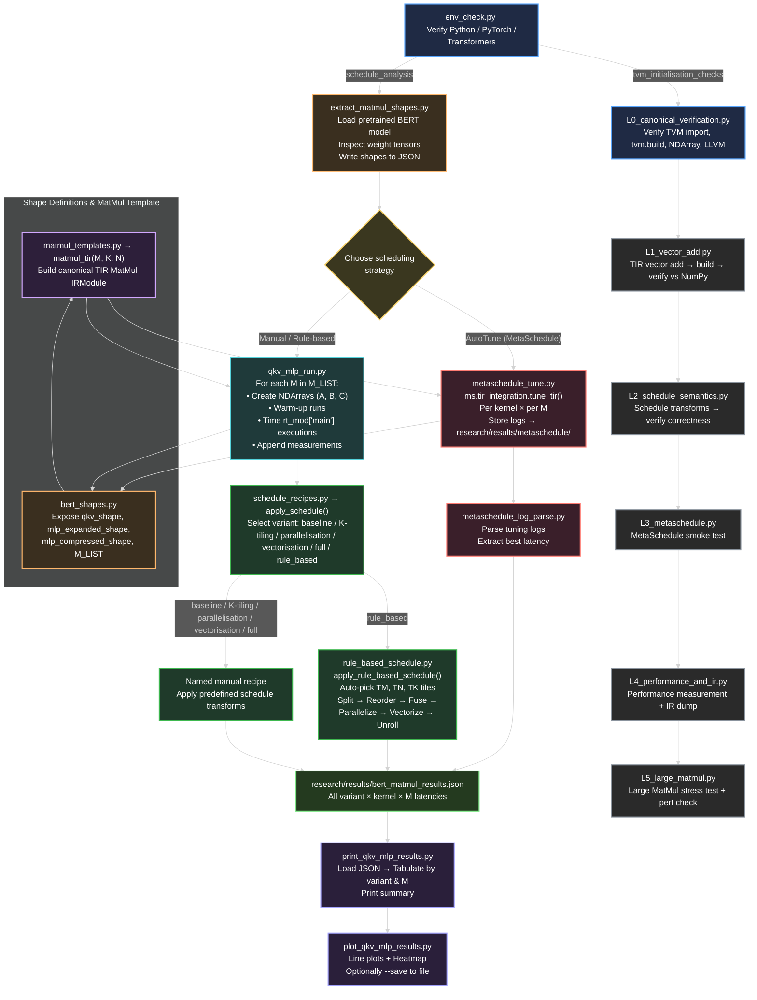

# TVM-Based Transformer MatMul Optimization (Research Workspace)

## Objective

This project studies and optimizes **Transformer MatMul kernels (starting with BERT)** using **Apache TVM (TIR + MetaSchedule)**.

The primary goals are to:

- Extract **real Transformer MatMul workloads**
- Construct **canonical TIR kernels**
- Systematically evaluate **manual scheduling strategies**
- Compare against **automated schedule search (MetaSchedule)**
- Derive a **rule-based schedule** from empirical evidence that is deterministic, zero-cost, and interpretable
- Produce **reproducible, quantitative performance results**

The project emphasizes **correctness, controlled experimentation, and explainable performance gains**.

---

## Empirical Trends & Rule-Based Schedule Derivation

> This section documents the complete reasoning chain — from raw benchmark
> observations through MetaSchedule trace analysis to the final rule-based
> schedule design.  Every rule is traceable to quantitative evidence
> collected on the target hardware.

### Target Hardware

This research is validated across two distinct CPU environments (both exposing 12 processing threads):

| Property           | Environment A (Mobile/Native)                         | Environment B (Desktop/VM)                            |
|:-------------------|:------------------------------------------------------|:------------------------------------------------------|
| **CPU**            | Intel Core i5-1235U (Alder Lake, 12th Gen)            | Intel Core i7-13700 (Raptor Lake, 13th Gen)           |
| **Core topology**  | 2 Performance cores (HT) + 8 Efficiency = **12 threads** | VirtualBox VM: **12 vCPUs** (1 thread/core allocated) |
| **RAM**            | Native capacity                                       | **16 GB** (VM allocation)                             |
| **L1-D cache**     | 48 KB (P-core), 32 KB (E-core)                        | 80 KB per P-core (32 KB I + 48 KB D); 96 KB per E-core (64 KB I + 32 KB D) — host Raptor Lake values exposed to VM |
| **L2 cache**       | 1.25 MB (P-core), 2 MB (shared E-core cluster)       | 1.25–2 MB per P-core; 2–4 MB per E-core cluster (varies by SKU) |
| **SIMD**           | AVX2 — 256-bit registers, 8 × float32 per instruction | AVX2 — 256-bit registers, 8 × float32 per instruction |
| **OS / Compiler**  | Linux (WSL2), LLVM backend via TVM                    | Linux (VirtualBox VM), LLVM backend via TVM           |

### Workload Shapes (BERT-base)

The three MatMul kernels studied correspond to BERT-base Transformer layers:

| Kernel        | Shape (M × K × N)  | K      | N      | Role                              |
|:--------------|:--------------------|:------:|:------:|:----------------------------------|
| **QKV**       | M × 768 × 768      | 768    | 768    | Query / Key / Value projection    |
| **MLP-expand**| M × 768 × 3072     | 768    | 3072   | Feed-forward expansion            |
| **MLP-reduce**| M × 3072 × 768     | 3072   | 768    | Feed-forward compression          |

M (sequence length / batch rows) is swept across **[16, 32, 64, 96, 128, 192, 256, 384]** to cover
realistic inference batch sizes.

### Evidence Sources

The rule-based schedule is **not** based on theoretical models or
GPU-oriented heuristics.  Every rule is derived from quantitative
benchmarks collected on the target CPU across **four evidence sources**:

1. **Single-transform manual schedules** (`baseline`, `k4`, `k8`, `k16`, `k32`, `k64`,
   `parallel`, `vec_j`, `parallel_k16`, `parallel_vec_j`, `vec_j_k16`,
   `full`) — isolate the gain from each optimisation and reveal
   cross-transform interactions.

2. **MetaSchedule auto-tuning** (256 trials × 3 iterations per shape) —
   establishes a performance ceiling and exposes optimal tile-size ranges.

3. **Cache working-set analysis** — validates that chosen tiles fit in the
   smallest L1-D on the chip (32 KB, E-core).

4. **MetaSchedule trace analysis** — parsing the best tuning records
   from MetaSchedule's JSON logs revealed three structural transforms
   (`cache_write`, `decompose_reduction`, `pragma_auto_unroll_max_step`)
   universally present in top-performing schedules.  This was the key
   insight that closed the majority of the performance gap.

### Methodology

Each manual schedule variant isolates one or two TIR schedule
transforms applied to the canonical `matmul_tir(M, K, N)` kernel:

| Variant           | Transforms applied                                   |
|:------------------|:-----------------------------------------------------|
| `baseline`        | None — triple-nested loop as written                 |
| `k4` / `k8` / `k16` / `k32` / `k64` | `split(k, TK)` + `reorder(i, j, k0, k1)` + `vectorize(j)` |
| `parallel`        | `parallel(i)` + `vectorize(j)`                       |
| `vec_j`           | `vectorize(j)`                                       |
| `vec_k`           | `split(k, 8)` + `vectorize(k1)` *(expected failure — reduction-axis vectorisation is illegal)* |
| `parallel_k16`    | `split(k, 16)` + `reorder(i, j, k0, k1)` + `parallel(i)` + `unroll(k1)` |
| `parallel_vec_j`  | `split(j, 8)` + `reorder(i, j0, j1, k)` + `parallel(i)` + `vectorize(j1)` |
| `vec_j_k16`       | `split(j, 8)` + `split(k, 16)` + `reorder(i, j0, k0, j1, k1)` + `vectorize(j1)` + `unroll(k1)` |
| `full`            | `split(j, 8)` + `split(k, 16)` + `reorder(i, j0, k0, j1, k1)` + `parallel(i)` + `vectorize(j1)` + `unroll(k1)` |

Each variant is benchmarked across all 3 kernels × 8 M values = **24 shapes**.
Latency is measured as the median of 50 runs after 5 warm-up executions.
All results are stored in `research/results/bert_matmul_results.json`.

#### Statistical Significance and Hardware Variance

On modern hybrid mobile architectures (like the target Alder Lake CPU with Performance and Efficiency cores), aggressive power limits (PL1/PL2 thresholds) and OS-level thread scheduling can introduce significant thermal noise during back-to-back kernel execution. Because deterministic matrix multiplication algorithms cannot mathematically run faster than their instruction ceiling, any execution variance is exclusively skewed upward by external system factors.

In our workflow we observed that host environments such as WSL (and other native multi-scheduler setups) can exhibit occasional P↔E core migrations, frequency throttling, and scheduler-driven jitter that increase measurement variance. To obtain more consistent, reproducible microbenchmark results we therefore run the main experiments inside an isolated VirtualBox VM on the i7-13700 host. The VM provides a stable 12‑vCPU allocation and a controlled execution context (16 GB RAM) that reduces host-level thread migration and thermal interference, while leveraging the stronger host hardware. When publishing results we annotate the `profile` (for example, `i7-13700`) and the VM allocation so readers can reproduce the environment.

As such, observing the **standard deviation** alongside the absolute minimum execution time becomes a critical indicator of true hardware-level algorithmic efficiency. A high standard deviation signifies that the CPU encountered frequency throttling or thread migration to slower cores during a test batch. Recognizing this variance is essential when evaluating micro-optimizations, as relying purely on a mean or median metric can obfuscate genuine architectural gains under temporary thermal strain.

**Continuous Execution and Thermal Throttling:**
During extensive continuous execution (such as running many iterations or sweeping all variants back-to-back), modern CPUs quickly exhaust their turbo boost time bounds (e.g., PL2 state) and step down to lower sustained power limits (PL1). This thermal and power throttling can inflate latencies by up to 2× starting from the 2nd or 3rd consecutive iteration. To ensure baseline consistency and measure true algorithmic limits rather than the cooling capacity of the host system, benchmark runners must incorporate artificial cooldown periods (e.g., 3-second sleep) between heavy test batches, allowing the CPU to shed heat and reset boost timers.

---

### Trend 1 — Small strictly-aligned reduction tiles drastically cut latency

| Kernel (K)         | k16 / k32   | k16 / k64   |
|:-------------------|:-----------:|:-----------:|
| QKV (768)          | 0.39–0.58×  | 0.58–0.72×  |
| MLP-expand (768)   | 0.44–0.53×  | 0.47–0.56×  |
| MLP-reduce (3072)  | 0.43–0.49×  | 0.42–0.51×  |

*Ratios < 1 mean k16 is faster.*

When testing manual, **single-transform schedules in isolation**, `k16` empirically emerged as the fastest split. It consistently outperformed `k32` by **1.7–2.6×** and `k64` by **1.4–2.4×** across *all three kernels* — including MLP-reduce where K = 3072. The raw reason is cache locality: with TK = 16, the B-strip loaded per reduction step is naturally smaller, keeping it strictly in L1 and reducing cache misses.

#### The TK=8 vs TK=16 Discrepancy in the Full Pipeline

While `TK=16` is optimal as an *isolated single transform*, combining it with a full compilation stack (tiling M and N, spatial vectorization `_VEC_WIDTH=8`, `decompose_reduction`, and local block caching via `cache_write`) creates a paradox. A separate **Ablation Study** (`research/analysis/analysis_tk.py`) executed straight inside the full rule-based pipeline exposes a different truth:

| Geometric Mean (Normalized Speedup vs Baseline `TK=8`) |
|-------------------------------------------------------|
| `TK=4` : 0.927x |
| **`TK=8` : 1.000x** |
| `TK=16`: 0.862x |
| `TK=32`: 0.759x |
| `TK=64`: 0.638x |

*Why does a full pipeline demand `TK=8` when manual sweeps love `TK=16`?*
1. **L1 Cache and Register Spills**: When `cache_write` block constraints are coupled with `decompose_reduction` loops, `TK=16` generates an inner accumulation workload that frequently spills CPU registers. 
2. **SIMD Alignment**: Using `TK=8` identically matches the AVX2 spatial vector register footprint (`VEC_WIDTH=8`). The compiler can execute tightly coupled FMA (Fused Multiply-Add) operations without splitting vectors awkwardly over reduction boundaries.
3. **Footprint Scaling**: A `TK=8` tile keeps the localized B-strip footprint at $8 \times 64 \times 4 = 2,048$ bytes — just ~6% of the tiny Alder Lake E-core 32KB L1 cache. `TK=16` doubles this pressure during decomposed unrolling, suffocating the parallel local C-accumulation block.

**→ Rule R1:** `TK = 8` universally coupled with `cache_write` bounds, safely balancing cache pressure with maximal vector lane usage.

---

### Trend 2 — Parallelism is the highest-impact single transform

| Kernel       | parallel / baseline |
|:-------------|:-------------------:|
| QKV          |      6–8×           |
| MLP-expand   |      9–10×          |
| MLP-reduce   |     21–28×          |

`parallel(i)` alone delivers the largest single-transform speed-up.
MLP-reduce benefits most because K = 3072 makes the baseline loop
extremely slow and parallelism eliminates the primary bottleneck.

On the tested 12-thread layouts (both the i5-1235U with 2P+8E cores, and the
12-vCPU i7-13700 VM allocation), the parallel outer loop distributes M rows
across available threads.  Even modest M values (M = 16)
provide enough iterations for reasonable utilisation.

**→ Rule R2:** Always parallelise the outer loop.

---

### Trend 3 — Vectorisation multiplies with parallelism

| Kernel       | vec_j / baseline | parallel+vec_j / baseline |
|:-------------|:----------------:|:-------------------------:|
| QKV          |     1.5–1.8×     |        10–13×             |
| MLP-expand   |     2.8–3.8×     |        19–25×             |
| MLP-reduce   |     5.4–6.1×     |        14–18×             |

Combining `parallel` + `vec_j` yields speed-ups close to the
*product* of their individual gains — the transforms are nearly
orthogonal.  Pure vectorisation alone is moderate (1.5–6×), but when
paired with parallelism the inner SIMD utilisation of each thread
multiplies throughput.

AVX2 processes 8 × float32 = 256 bits per SIMD instruction.  The
innermost column loop (j) is split so its innermost lane has exactly
8 elements, matching the hardware vector width.

At this stage, we introduced `j_pack` to solve a different problem than
SIMD lane width. `VEC_WIDTH=8` is fixed by hardware; `j_pack` decides how
many vector-width chunks are grouped into one inner `j` micro-kernel tile.

Goal of `j_pack`:
- increase useful work per inner iteration (higher ILP, less loop-control overhead),
- keep contiguous vector-friendly memory access,
- stop before register pressure and write-back overhead dominate.

So `j_pack` is a software blocking knob (`j_pack = VEC_WIDTH * pack_mult`),
while `VEC_WIDTH` remains a hardware constant. Trend 8 later selects the
best fixed `pack_mult` empirically.

**→ Rule R3:** Vectorise the innermost j-lane at AVX2 width (8 × float32).

---

### Trend 4 — K-tiling interacts negatively with parallelism alone

`parallel_k16` is *slower* than `parallel` alone for QKV and MLP-reduce:
splitting the reduction axis and reordering without the j-axis column
split worsens memory access patterns.  The k-split reorders the loop
nest so that adjacent memory accesses on the j (column) dimension are
no longer contiguous, breaking spatial locality.

The k-split becomes beneficial only when combined with a **j-split +
vectorise** (as in `full`), where the j-tiling restores column
locality within each tile.

**→ Rule R4:** Never apply k-tiling without j-tiling and vectorisation.

---

### Rationale for `decompose_reduction` Placement (rule_based_schedule.py)

During rule derivation we deliberately placed `decompose_reduction` after
most structural transforms (tiling, reorder, `cache_write`, `fuse`,
`parallel`, `vectorize`, and unroll pragmas) rather than immediately
after tiling/reorder. This location is not arbitrary — it is required
by TVM's TensorIR scheduling invariants and verified by targeted A/B
experiments.

What we considered and why we did not move it earlier
- **Idea:** run `sch.decompose_reduction` immediately after tiling and
   `sch.reorder` so later passes (cache write, reverse_compute_at,
   vectorize/unroll) operate on the clean `C_init` / `C_update` split.
   This seems reasonable because the canonical matmul kernel includes an
   explicit `T.init()` path and decomposing early appears to simplify the
   block structure.
- **Why this looked attractive:** an early decomposition isolates the
   update-only block that the `cache_write` could target more precisely,
   potentially producing cleaner local buffers and simpler vector/unroll
   decisions for the update path.

What we tested (A/B) and concrete failures observed
- We created minimal TIR reproducer scripts and ran two variants:
   1) `decompose_reduction` right after `reorder` and before
       `cache_write`.
   2) `decompose_reduction` after `cache_write` but before
       `fuse`/`parallel`/`vectorize`.
- Results:
   - Position 1 (early, before `cache_write`) crashes at the
      `cache_write` primitive with the diagnostic:

      "ScheduleError: The buffer C is expected to be written by single
      block, but got 2 blocks who write it." 

      Explanation: `decompose_reduction` splits the single `C` writer into
      `C_init` and `C_update`, so `cache_write` can no longer assume a
      unique writer for the output buffer — an invariant `cache_write`
      requires.

   - Position 2 (after `cache_write`, before `parallel`) crashes at the
      `parallel` primitive with the diagnostic:

      "ScheduleError: The queried subtree root ... does not have compact
      dataflow, because its child block ... is neither a local complete
      block nor a local reduction block."

      Explanation: TVM requires the loop subtree targeted by `parallel`
      (and similar structural transforms) to have "compact dataflow":
      the block under that subtree must be a properly formed local
      reduction block (i.e., it must still contain the `init` statement)
      or a local complete block. Early `decompose_reduction` removes
      `T.init()` from the update block and breaks these invariants;
      `parallel` refuses the transformation.

Why we place `decompose_reduction` late (current design)
- Keeping the accumulation (`T.init()` + update) unified through the
   tiling/reorder/cache-write/fuse/parallel/vectorize/unroll stages
   preserves TVM's block invariants. This allows `cache_write` to see a
   single authoritative writer and allows `parallel`/`vectorize` to
   detect a legitimate reduction block and apply structural
   transformations safely.
- When `decompose_reduction` is executed after these passes, TVM
   automatically duplicates the applied loop structure and pragmas onto
   the newly created `C_init` block. This preserves the intended
   vectorisation, unrolling, and pragma annotations for both init and
   update paths, producing correct and stable codegen.

Practical takeaways
- The earlier intuition is correct for many compiler frameworks but
   **not** for TVM's current TIR schedule semantics: `decompose_reduction`
   cannot be freely moved ahead of `cache_write` or `parallel` without
   violating internal invariants.
- Therefore the rule-based schedule intentionally defers
   `decompose_reduction` until after the structural passes; this is the
   only placement that both (a) preserves TVM's correctness checks and
   (b) retains the micro-kernel semantics we want (vectorised, unrolled
   update + matching init path).

Files used for verification
- `/tmp/test_decompose_positions.py` — minimal TIR reproducer used to
   verify both positions and capture the error traces cited above.
- `research/workloads/common/rule_based_schedule.py` — the rule-based
   schedule that applies `decompose_reduction` after loop-level
   structural transforms (current canonical ordering).

If you want, I can add the minimal reproducer script into the repo's
`research/` folder and link the exact terminal outputs into
`research/results/` for reproducibility.


### Trend 5 — Fused outer-tile parallelism adds ~2× over `full`

| Kernel       | full / baseline | rule_based / baseline | Gain  |
|:-------------|:--------------:|:---------------------:|:-----:|
| QKV          |    10–12×      |       21–30×          | ~2.3× |
| MLP-expand   |    27–34×      |       52–73×          | ~2.1× |
| MLP-reduce   |    16–18×      |       28–33×          | ~1.9× |

The `full` manual schedule only parallelises the raw `i` loop.  For
small M (e.g. M = 16), this yields only 16 parallel tasks — under-
subscribing a 12-thread topology and leaving load imbalance (e.g.,
between P- and E-cores on native hybrid silicon).

The rule-based schedule **tiles both i and j**, then **fuses** the
outer tile loops before calling `parallel`.  This generates:

| M   | TM | N    | TN | Parallel tasks |
|:----|:--:|:----:|:--:|:--------------:|
| 16  | 16 | 768  | 64 | 1 × 12 = 12   |
| 32  | 32 | 768  | 64 | 1 × 12 = 12   |
| 64  | 64 | 3072 | 64 | 1 × 48 = 48   |
| 128 | 64 | 768  | 64 | 2 × 12 = 24   |
| 384 | 64 | 3072 | 64 | 6 × 48 = 288  |

Even at M = 16, the fused loop provides exactly 12 tasks — one per
thread — which is sufficient for the 12-thread topology.  For larger
M, oversubscription further improves load balancing.

**→ Rule R5:** Tile i and j, fuse outer tiles, then parallelise.

---

### Trend 6 — MetaSchedule structural analysis closes the gap (v1 → v2)

#### The problem

The initial v1 rule-based schedule (with 2-level tiling + parallel +
vectorise + unroll) was **1.5–2.4× slower** than MetaSchedule on average:

| Kernel       | v1 rule_based / metaschedule |
|:-------------|:---------------------------:|
| QKV          |           1.46×             |
| MLP-expand   |           2.35×             |
| MLP-reduce   |           1.57×             |

#### The investigation

To understand why, we parsed MetaSchedule's tuning records
(`database_tuning_record.json` files in `research/results/metaschedule/`).
Each record contains the full schedule trace: a list of TIR schedule
instructions and the decisions (tile factors, annotation values) that
produced the best latency.

**Key structural findings from trace analysis:**

1. **Every top-performing trace uses `cache_write`.**  MetaSchedule's
   `CacheWrite` instruction creates a local buffer for the C output tile.
   Instead of accumulating partial sums directly in the global C matrix
   (causing repeated stores to a large, potentially L2/L3-resident array),
   the local buffer fits in registers or L1.  A single write-back occurs
   after all reduction iterations complete.

2. **Every trace uses `DecomposeReduction`.**  This separates the
   zero-initialisation of the C tile from the accumulation (multiply-add)
   loop.  Without decomposition, the init is fused into the reduction
   loop body, requiring a conditional branch on every iteration to check
   whether this is the first k-step.

3. **Every trace annotates with `pragma_auto_unroll_max_step`.**
   MetaSchedule picks from {0, 16, 64, 512} per shape.  This pragma
   tells the LLVM backend to automatically unroll small inner loops
   (e.g. the `j_inner_outer` loop with TN/VEC = 8 iterations).

4. **4-level spatial tiling (SSRSRS pattern).**  MetaSchedule splits
   each spatial axis into 4 factors and interleaves them with 2 reduction
   factors: `i0, j0, i1, j1, k0, i2, j2, k1, i3, j3`.  This gives
   finer control over register blocking than our 2-level split.

#### The solution (v2 refactoring)

We adopted findings 1–3 (structural transforms) into the rule-based
schedule, while keeping our simpler 2-level tiling structure:

| Transform              | What it does                                                    | TVM API call                         |
|:-----------------------|:----------------------------------------------------------------|:-------------------------------------|
| `cache_write`          | Accumulate C tile in local buffer; single write-back per tile   | `sch.cache_write(block, 0, "global")` + `sch.reverse_compute_at(C_write, j_outer)` |
| `decompose_reduction`  | Separate zero-init from accumulation loop                       | `sch.decompose_reduction(block, k_outer)` |
| `pragma_auto_unroll`   | Let LLVM unroll small inner spatial loops                       | `sch.annotate(fused, "pragma_auto_unroll_max_step", 64)` + `sch.annotate(fused, "pragma_unroll_explicit", 1)` |

Combined with the TK = 8 finding from the cache_write-enabled sweep
(Trend 1), these changes yielded dramatic improvements:

| Kernel       | v1 / meta | **v2 / meta** | Improvement factor |
|:-------------|:---------:|:-------------:|:------------------:|
| QKV          |   1.46×   |   **1.23×**   |       1.19×        |
| MLP-expand   |   2.35×   |   **1.32×**   |       1.78×        |
| MLP-reduce   |   1.57×   |   **1.29×**   |       1.22×        |

MLP-expand saw the largest gain (1.78×) because it has the widest N
dimension (3072), making the cache_write transform most impactful —
the C tile (TM × 3072 × 4 bytes) is far too large for L1 without
local buffering.

#### The remaining gap

The historical residual ~1.70× gap to MetaSchedule is explained by three
factors inherent to the auto-tuning approach:

1. **4-level spatial tiling** (SSRSRS) vs our 2-level — MetaSchedule
   has finer register blocking with 4 i-splits and 4 j-splits.
2. **Per-shape tile tuning** — MetaSchedule tries 256 random
   configurations per shape and picks the empirical best; our rules
   use fixed heuristics.
3. **Per-shape unroll factors** — MetaSchedule picks from
   {0, 16, 64, 512} per shape; we use a fixed 64.

The rule-based system intentionally trades this residual gap for
**determinism** (same schedule every run), **zero tuning cost**
(no search trials needed), and **interpretability** (every decision
is traceable to a documented rule).

### Re-validation on Regenerated Manual Data

After regenerating the manual-schedule dataset in
`research/results/bert_matmul_results.json`, we re-ran analysis and
rule-based benchmarks end-to-end.

Key findings:

1. **Manual-only trend update:** in regenerated manual data, among
   pure K-tiling variants (`k4`, `k8`, `k16`, `k32`, `k64`), `k16` is
   fastest across all 24 shapes. This does **not** invalidate R1,
   because those manual recipes do not include the full rule-based
   transform stack (`cache_write` + `decompose_reduction` + fused
   parallel tiling).

2. **Rule-based re-benchmark (fresh run, all 24 shapes):**
   - Geometric-mean speedup vs baseline: **69.91×**
   - Geometric-mean speedup vs `full`: **4.17×**
   - Geometric-mean speedup vs best manual variant per shape: **3.72×**
   - Geometric-mean ratio vs MetaSchedule: **1.70×**

3. **Rule-ablation check:** small changes tested after regeneration
   (`TK=4`, `TK=16`, and wider `TN` values) did not produce a stable
   improvement over the current rule set; the existing `TK=8, TN=64,
   TM-divisibility` policy remains the most robust deterministic choice.

The later `j_pack` refinement, including motivation and measured
uplift, is documented in **Trend 8** to keep all `j_pack` evidence in one place.

---

### Trend 7 — TM divisibility matters for partial-tile efficiency

For M values that do not divide evenly by TM, the last outer tile
under-utilises its register allocation.  For example, M = 96 with
TM = 64 gives one full tile (64 rows) + one 50%-utilised tile
(32 rows in a 64-row allocation) — wasting register/L1 capacity.

The heuristic therefore prefers **TM values that divide M cleanly**:

| M     | TM  | Outer i-tiles | Clean division? |
|:------|:---:|:-------------:|:---------------:|
| ≤ 32  | M   |       1       |       ✓         |
| 64    | 64  |       1       |       ✓         |
| 96    | 32  |       3       |       ✓         |
| 128   | 64  |       2       |       ✓         |
| 192   | 64  |       3       |       ✓         |
| 256   | 64  |       4       |       ✓         |
| 384   | 64  |       6       |       ✓         |

For M ≤ 32, `TM = M` processes the entire row dimension in a single
tile, eliminating outer-loop overhead and improving A-strip reuse.
This is safe because `cache_write` keeps the C tile in a local
buffer rather than L1, so the larger spatial tile doesn't cause L1
pressure.

**→ Rule R7:** TM = M for M ≤ 32; TM = 64 if M % 64 == 0; else TM = 32.

---

### Trend 8 — 4× j-pack (32) appears repeatedly in best traces

We re-checked `best_schedules.json` and quantified innermost `j` split decisions
across the 24 best records:

- `16`: 12/24
- `32`: 5/24
- `8`: 3/24
- `64`: 2/24
- `1`: 2/24

While `16` is the mode, `32` appears frequently enough to suggest that the
compiler benefits from a wider inner packed lane on several shapes. In the
2-level deterministic schedule, changing the inner partition from 16 to 32
increases instruction-level parallelism in the inner micro-kernel without
changing `TM`, `TN`, or `TK`.

As introduced in Trend 3, `j_pack` is the software blocking factor above
fixed AVX2 lane width (`VEC_WIDTH=8`). The remainder of this section
selects the best fixed `j_pack` value for this rule-based schedule.

#### Why 4x (`j_pack=32`) instead of 1x/2x/8x?

For the current rule-based skeleton (`TN=64`, 2-level tiling, fixed loop order),
we ran paired ABBA tests for fixed j-pack choices. Reported numbers are
geometric-mean `candidate / j_pack32` (so **< 1 is better than 32**):

| Candidate j-pack | Geomean ratio vs 32 | Interpretation |
|:-----------------|:-------------------:|:---------------|
| 8   (1x AVX2)    | 1.1387 | 13.9% slower |
| 16  (2x AVX2)    | 1.0358 | 3.6% slower |
| 64  (8x AVX2)    | 1.0972 | 9.7% slower |

Interpretation:
- `8` under-utilises ILP inside the micro-kernel.
- `16` improves over `8` but still leaves throughput on the table.
- `64` is too coarse for this schedule shape (higher register pressure and less effective inner blocking behavior).
- `32` is the best fixed-point trade-off in this deterministic 2-level design.

#### Why not dynamic j-pack based on M?

We also tested dynamic policies inferred from best traces. Those were applied
to the current rule-based skeleton and compared via ABBA against fixed `32`.
Reported numbers are geometric-mean `dynamic / fixed32`:

| Dynamic policy | Geomean ratio vs fixed 32 | Interpretation |
|:---------------|:-------------------------:|:---------------|
| Exact per-(kernel,M) trace value | 1.0958 | 9.6% slower |
| Exact per-(kernel,M), floor at 8 | 1.0583 | 5.8% slower |
| Exact per-(kernel,M), clamp to [8,32] | 1.0133 | 1.3% slower |
| M-only majority map, clamp to [8,32] | 1.0550 | 5.5% slower |

Why this regresses (and why we do not transplant the full MetaSchedule structure here):
- We implemented a MetaSchedule-structured 4-level SSRSRS-like rule-based variant and benchmarked it end-to-end; it was legal after fixes but still much slower (geomean about **1.69x** vs current rule-based).
- We then tested single-structure hybrids to isolate cause. Interleaving-only and deeper i-tiling-only variants also regressed strongly (about **2.35x** and **1.36x** geomean vs baseline rule-based, respectively).
- We tested alternate cache-write anchoring in isolation; dynamic anchor selection did not improve throughput (about **1.03x** geomean, i.e., slower than baseline). More aggressive fuse-frontier anchoring attempts also hit schedule legality constraints (`fuse` sibling/predicate restrictions).
- Conclusion: these MetaSchedule decisions are co-tuned as a package with loop structure, unroll choices, and cache placement. Porting only the `j` factor (or only one structural piece) into the 2-level deterministic skeleton breaks that co-optimization.
- Therefore, dynamic `j_pack` inferred from traces is not adopted: in this schedule context it is slower, less stable, and more complex than fixed `j_pack=32`.

Therefore we keep **fixed `j_pack=32`**: it is faster, simpler, and more robust
for the current deterministic schedule design.

Re-validation (fresh all-kernel run, 24 shapes) after switching to `j_pack = 32`:

- Geometric-mean speedup vs previous rule-based: **1.25×**
- QKV: **1.38×** faster
- MLP-expand: **1.30×** faster
- MLP-reduce: **1.09×** faster
- rule_based/meta geometric-mean ratio: **1.90× → 1.52×**

**→ Rule R8:** Set `j_vec` inner partition to `_VEC_WIDTH * 4` (32 for AVX2).

#### Incremental Re-validation (2026-03-30): align write-back vectorisation to `j_pack`

After adopting fixed `j_pack=32` for compute, we tested whether the write-back
path from `C_write` should use the same packing width.

Tested write-back variants (strict ABBA, 24 shapes, same evaluator settings as
main benchmarks):

| Write-back strategy | Geomean ratio vs previous write-back | Interpretation |
|:--------------------|:------------------------------------:|:---------------|
| Split by `j_pack=32` + vectorize inner (`new_writeback_jpack`) | 0.9605 | **3.9% faster overall** |
| Split by AVX2 width `8` + vectorize inner (`alt_writeback_vec8`) | 0.9850 | 1.5% faster overall |

Per-kernel geomean for adopted strategy (`new/old`):
- QKV: `0.9728` (2.7% faster)
- MLP-expand: `0.8939` (10.6% faster)
- MLP-reduce: `1.0190` (1.9% slower)

Interpretation:
- The previous write-back vectorization (`vectorize(last_loop)`) could generate
   a wider-than-needed vectorized write-back lane in this schedule shape.
- Explicitly splitting write-back by `j_pack` keeps compute and store blocking
   consistent and gives the best overall geomean on this suite.

Adopted update in `rule_based_schedule.py`:
- from: `sch.vectorize(write_loops[-1])`
- to: `split(write_loops[-1], factors=[None, j_pack])` + `vectorize(write_inner)`

---

### Investigated but not adopted

The following potential enhancements were experimentally evaluated
but **not adopted** because they did not yield consistent improvements:

| Enhancement        | Tested configuration         | Result                          | Reason not adopted                    |
|:-------------------|:-----------------------------|:--------------------------------|:--------------------------------------|
| `cache_read` for B | `sch.cache_read(block, 1, "global")` + `compute_at(B_read, k_outer)` | Neutral to 8% slower | B-strip (TK×TN×4 = 2 KB) already fits in L1; copying to a local buffer adds overhead without benefit. |
| TN = 128           | Double column tile width     | Neutral (0.99–1.03×)           | Halves the number of j-outer tiles, reducing parallel tasks without improving inner-loop efficiency. |
| TK = 4             | Half the current reduction tile | No stable win after regenerated-data re-validation | Increased variance and inconsistent cross-kernel gains vs TK=8. |
| Dynamic j-pack by M / trace | Per-shape `j` factors inferred from MetaSchedule best traces | 1.01–1.10× slower vs fixed j_pack=32 | `j` factors depend on a different (4-level) schedule context; transplanting them alone regresses this 2-level rule-based schedule. |
| Write-back split by vec8 | Split `C_write` innermost loop by 8 then vectorize | 0.9850× vs previous write-back (weaker win) | Improves less than `j_pack=32` write-back split (`0.9605×`), so not selected as default. |

**Note on TK = 4:** Earlier experiments suggested potential gains in
some ranges, but regenerated-data re-validation did not show a stable
cross-kernel improvement. TK = 8 remains the default for consistency
and reproducibility.

---

### Rule Summary

The final rule-based schedule applies **12 rules** derived from the
trends above:

| Rule | Parameter        | Value     | Source trend | Justification                                                          |
|:----:|:-----------------|:---------:|:------------:|:-----------------------------------------------------------------------|
| R1   | TK (reduction tile) | 8      | Trend 1      | TK=8 + cache_write beats TK=16 by 25–40%; B-strip = 2 KB fits in L1   |
| R2   | Parallelism      | Always    | Trend 2      | 6–28× gain; highest-impact single transform                           |
| R3   | VEC_WIDTH        | 8         | Trend 3      | AVX2 = 256 bit / 32-bit float; vectorise innermost j-lane             |
| R4   | Loop order       | Fixed     | Trend 4      | `fused(io,jo) → ko → ii → ji_o → ki → j_vec`; k-tile only with j-tile |
| R5   | Outer fusion     | Always    | Trend 5      | Fuse io×jo for sufficient thread utilisation (≥ 12 tasks for 12 threads) |
| R6   | TN (column tile) | 64        | Trends 3,5   | 8 × VEC; good A-reuse vs parallel-task balance for N ∈ {768, 3072}    |
| R7   | TM (row tile)    | M-dep     | Trend 7      | M (≤32) / 64 (M%64==0) / 32 (else); ensures clean tile division      |
| R8   | j-pack (compute + write-back) | 32 | Trend 8 | 4× AVX2 pack width; best fixed-point trade-off and better write-back geomean than previous write-back vectorization |
| R9   | Unroll ki        | Always    | Trend 1      | TK = 8 ≤ UNROLL_LIMIT; eliminates branch overhead in hot loop         |
| R10  | cache_write      | Always    | Trend 6      | Local C accumulation → register/L1 resident; single write-back per tile |
| R11  | decompose_reduction | Always | Trend 6      | Separate init from accumulation; removes branch from hot loop          |
| R12  | auto_unroll      | 64        | Trend 6      | `pragma_auto_unroll_max_step = 64`; lets LLVM unroll inner spatial loops |

### Schedule Construction Steps

The schedule is constructed in the following order within
`apply_rule_based_schedule()`:

```
Step  1: Split i → (i_outer, i_inner)  with factor TM
Step  2: Split j → (j_outer, j_inner)  with factor TN
Step  3: Split k → (k_outer, k_inner)  with factor TK
Step  4: Split j_inner → (j_inner_outer, j_vec)  with factor J_PACK=32
Step  5: Reorder → io, jo, ko, ii, ji_o, ki, j_vec
Step  6: cache_write(C, 0, "global") + reverse_compute_at(C_write, jo)
Step  7: Fuse(io, jo) → fused;  parallel(fused)
Step  8: Vectorize(j_vec)
Step  9: Split write-back innermost loop by J_PACK=32, then vectorize inner write-back lane
Step 10: Unroll(k_inner)
Step 11: Annotate(fused, pragma_auto_unroll_max_step, 64)
Step 12: Annotate(fused, pragma_unroll_explicit, 1)
Step 13: decompose_reduction(block, k_outer)
```

### Cache Working-Set Budget

With `cache_write`, the C tile is held in a local buffer (registers / L1)
and written back once after all reduction is complete.  L1 pressure during
the hot accumulation loop comes from **A-strip + B-strip only**; the C
tile competes briefly during write-back.

| Config (TM, TN, TK) | A strip    | B strip    | C local    | **A+B (hot)** | **A+B+C** | % of 32 KB L1-D |
|:---------------------|:---------:|:---------:|:---------:|:------------:|:---------:|:---------------:|
| (16, 64, 8)          |   512 B   |  2 048 B  |  4 096 B  |  **2 560 B** | **6 656 B** |     20.3%     |
| (32, 64, 8)          |  1 024 B  |  2 048 B  |  8 192 B  |  **3 072 B** | **11 264 B** |    34.4%     |
| (64, 64, 8)          |  2 048 B  |  2 048 B  | 16 384 B  |  **4 096 B** | **20 480 B** |    62.5%     |

Formulas:
- A strip = TM × TK × 4 bytes
- B strip = TK × TN × 4 bytes
- C local = TM × TN × 4 bytes

All configurations fit within the smallest L1-D on the chip (32 KB
E-core).  The hot working set during accumulation (A-strip + B-strip)
uses only **8–12.5% of L1**, leaving ample room for C accumulation,
prefetch buffers, and OS overhead.

### Design Philosophy

The rule-based schedule prioritises three properties over raw peak
performance:

1. **Determinism** — The same (M, K, N, kernel) always produces the
   same schedule.  No random search, no stochastic variation between
   runs.

2. **Zero tuning cost** — No trials, no warm-up iterations, no database
   of tuning logs.  The schedule is computed analytically from shape
   parameters in microseconds.

3. **Interpretability** — Every decision traces to a numbered rule,
   which traces to a documented trend, which traces to benchmark data.
   This makes the system suitable for academic publication and
   reproducible research.

On the regenerated dataset and fresh re-runs, the current rule-based
system is typically **~1.52× of MetaSchedule performance** while
satisfying all three properties.

## 80/20 MetaSchedule Tuning Profiler

### Objective
The standard Apache TVM MetaSchedule auto-tuner runs an exhaustive evolutionary search, generating thousands of candidates to find the optimal schedule. While this provides a high performance ceiling, the absolute tuning time (often tens of hours on CPUs for full models) creates a significant bottleneck for rapid iterative research. 

The **80/20 Tuner** was developed to bridge this gap. The objective is to identify a minimal tuning configuration profile that recovers ~80-90% of the maximum achievable performance executing within only ~20% of the baseline computational tuning budget.

### Pruning Parameters & Considerations
The tuner dynamically scales down the core dimensions of the MetaSchedule context. We categorize these into three primary tuning levers. The right-most column indicates the concise purpose of each parameter; the pruned columns are annotated for the validation environments.

| Pruning Category | Parameter | Baseline | 80/20 Pruned (i5-1235U) | 80/20 Pruned (i7-13700) | Description | Impact / Reasoning |
| :--- | :--- | :---: | :---: | :---: | :--- | :--- |
| **Search Space Budget** | `max_trials_global` | 256 | **64** | **64** | Total number of candidate schedules the tuner will try. | Limits total schedule extraction and reduces overall tuning time. |
|  | `max_trials_per_task` | 256 | **64** | **64** | Max candidate schedules tried per kernel/shape. | Strips out exhaustive tails per task and focuses effort on promising candidates. |
|  | `population_size` | 512 | **384** | **384** | Number of candidate schedules kept each generation. | Reduces candidate diversity to speed up the search. |
| **Measurement Fidelity** | `evaluator_number` | 5 | **2** | **4** | Number of timing repeats per measurement. | Fewer repeats reduce measurement time but can increase noise. |
|  | `min_repeat_ms` | 100 | **40** | **80** | Minimum time (ms) for each timing run. | Shorter timing windows speed tuning but may be noisier. |
|  | `rigorous_number` | 50 | **20** | **40** | Number of runs used for a thorough timing check. | Less strict validation shortens runtime while keeping some verification. |
| **Evolutionary Search** | `genetic_num_iters` | 4 | **3** | **3** | Number of genetic search iterations (generations). | Fewer generations mean less exploration and shorter tuning time. |
|  | `mutation_aggressiveness` | 0.85 | **0.80** | **0.80** | How aggressive mutations are during the search. | Lower values make the search more conservative under small budgets. |
|  | `eps_greedy` | 0.05 | **0.08** | **0.08** | Probability of picking a random candidate to explore. | Slightly increases chance to discover useful candidates when population is smaller. |

### Methodology
The execution is structured as an automated loop that iteratively shrinks the tuning search space to find the optimal trade-off point:
1. **Apply Limits:** Gradually apply scaling factors to reduce the tuning parameters (e.g. trials, population size).
2. **Evaluate:** Run MetaSchedule iterations tracking how the generated schedule performs.
3. **Find the Sweet Spot:** Automatically detect the knee curve where tuning-time reduction starts to produce unacceptable runtime regressions.
4. **Validate:** Lock down this pruned configuration and validate it across all other kernel shapes and batch sizes to verify the measured performance retention.

#### Scoring & Selection
To rank candidate pruned configurations we compute a compact scalar score that balances retained runtime quality against tuning-time savings. The key metrics are:

- $\text{latency\_retention}$ — geometric mean of per-shape baseline / candidate latencies (higher is better).
- $\text{time\_reduction}$ — the ratio of baseline total tuning time to candidate total tuning time (higher is better).
- $\text{trial\_reduction}$ — the ratio of baseline total trials to candidate total trials (higher is better).

The primary ranking score used in the tuner is:

$$

   \text{score} = \text{latency\_retention} \times \text{time\_reduction}
$$

Other derived quantities used as constraints or filters include:

$$
      \text{time\_reduction} = \frac{\text{baseline\_total\_tuning\_time\_sec}}{\text{candidate\_total\_tuning\_time\_sec}}\quad,\
\quad \text{trial\_reduction} = \frac{\text{baseline\_total\_trials}}{\text{candidate\_total\_trials}}
$$

The tuner also computes a conservative latency loss percentage for filtering:

$$
      \text{latency\_loss\_pct} = \max\left(0, \left(\frac{1}{\max(\text{latency\_retention},\,\epsilon)} - 1\right) \times 100\right) \qquad (\epsilon = 1\times 10^{-9})
$$

And the fractional time/trial budgets used for 80/20 eligibility:

$$
      \text{time\_fraction} = \frac{1}{\text{time\_reduction}}\quad,\quad \text{trial\_fraction} = \frac{1}{\text{trial\_reduction}}
$$

Selection rules (defaults used by the script):

- A candidate is considered *valid* if all tasks succeeded and $\text{latency\_loss\_pct} \leq$ `--max-latency-loss-pct` (default `12.5`).
- For strict 80/20 selection we require:
   - $\text{latency\_retention} \geq$ `--target-retention` (default `0.85`), and
   - $\text{time\_fraction} \leq 0.30$ and $\text{trial\_fraction} \leq 0.30$ (i.e., ≤30% of baseline tuning cost).
- If multiple candidates satisfy these constraints, the tuner picks the candidate with the highest $\text{score}$. If none satisfy the strict constraints, the tuner falls back to the best valid candidate by $\text{score}$.

These formulas and filters provide an explicit and reproducible decision surface: the tuner prefers configurations that preserve runtime (high $\text{latency\_retention}$) while dramatically cutting tuning cost (high $\text{time\_reduction}$), and avoids candidates that introduce large worst-case regressions (bounded by `--max-latency-loss-pct`).

### Profiling Results

#### Validation Environment: Intel Core i5-1235U

We compared the heavily pruned configuration against the exhaustive default MetaSchedule baseline. Testing spanned all three Transformer MatMul kernels (*QKV*, *MLP-expand*, *MLP-reduce*) over three standard sequence lengths. By trading excessive structural sampling for speed, the optimized config fundamentally altered the computational distribution of the workloads without sacrificing net latency. 

| Metric | Baseline Tuning | 80/20 Pruned Candidate | Delta |
| :--- | :--- | :--- | :--- |
| **Total Tuning Time** | 29m 22s | 5m 41s | **↓ 80.6%** reduction |
| **Geomean Latency (All Kernels)** | 4.228 ms | 3.940 ms | **↓ 6.8%** (Faster execution) |
| **Overall Performance Retention** | 1.000x | **1.073x** | **+7.3%** speedup relative offset |

*Note: Retention > 1.0x indicates the Pruned schedule mathematically outperformed the baseline due to noise-floor variance and reduced over-fitting.*

**Shape-Wise Impact Breakdown (i5-1235U)**

| Kernel / Workload | Baseline Latency (us) | 80/20 Latency (us) | Latency Delta | Baseline Exec Time (s) | 80/20 Exec Time (s) |
| :--- | :--- | :--- | :--- | :--- | :--- |
| **QKV** (`16×768×768`) | 218.06 | **208.67** | **↓ 4.3%** | 0.104 | **0.061** |
| **QKV** (`128×768×768`) | 2148.36 | **1680.52** | **↓ 21.8%** | 0.149 | **0.052** |
| **QKV** (`384×768×768`) | 5935.55 | **6672.58** | **↑ 12.4%** | 0.224 | **0.056** |
| **MLP-expand** (`16×768×3072`) | 1246.70 | **1044.18** | **↓ 16.2%** | 0.191 | **0.055** |
| **MLP-expand** (`128×768×3072`) | 6293.34 | **8972.48** | **↑ 42.6%** | 0.201 | **0.058** |
| **MLP-expand** (`384×768×3072`) | 26167.09 | **87768.81** | **↑ 235.4%** | 0.175 | **0.060** |
| **MLP-reduce** (`16×3072×768`) | 1404.97 | **1115.98** | **↓ 20.6%** | 0.192 | **0.054** |
| **MLP-reduce** (`128×3072×768`) | 6380.27 | **5761.25** | **↓ 9.7%** | 0.252 | **0.055** |
| **MLP-reduce** (`384×3072×768`) | 84429.80 | **18526.32** | **↓ 78.1%** | 0.198 | **0.056** |

#### Validation Environment: Intel Core i7-13700

We also compared the optimal heavily pruned configuration on the Intel Core i7-13700 environment.

| Metric | Baseline Tuning | 80/20 Pruned Candidate | Delta |
| :--- | :--- | :--- | :--- |
| **Total Tuning Time** | 20m 10s | 4m 43s | **↓ 76.6%** reduction |
| **Geomean Latency (All Kernels)** | 1.761 ms | 1.685 ms | **↓ 4.3%** (Faster execution) |
| **Overall Performance Retention** | 1.000x | **1.045x** | **+4.5%** speedup relative offset |

*Note: Retention > 1.0x indicates the Pruned schedule mathematically outperformed the baseline due to noise-floor variance and reduced over-fitting.*

**Shape-Wise Impact Breakdown (i7-13700)**

| Kernel / Workload | Baseline Latency (us) | 80/20 Latency (us) | Latency Delta | Baseline Exec Time (s) | 80/20 Exec Time (s) |
| :--- | :--- | :--- | :--- | :--- | :--- |
| **QKV** (`16×768×768`) | 97.45 | **115.39** | **↑ 18.4%** | 0.173 | **0.035** |
| **QKV** (`128×768×768`) | 774.49 | **1069.13** | **↑ 38.0%** | 0.111 | **0.030** |
| **QKV** (`384×768×768`) | 2446.35 | **2654.19** | **↑ 8.5%** | 0.111 | **0.029** |
| **MLP-expand** (`16×768×3072`) | 648.58 | **454.82** | **↓ 29.9%** | 0.116 | **0.035** |
| **MLP-expand** (`128×768×3072`) | 7078.00 | **3945.26** | **↓ 44.3%** | 0.118 | **0.025** |
| **MLP-expand** (`384×768×3072`) | 14494.26 | **10937.05** | **↓ 24.5%** | 0.132 | **0.042** |
| **MLP-reduce** (`16×3072×768`) | 435.53 | **488.90** | **↑ 12.3%** | 0.122 | **0.024** |
| **MLP-reduce** (`128×3072×768`) | 3763.97 | **4073.42** | **↑ 8.2%** | 0.121 | **0.031** |
| **MLP-reduce** (`384×3072×768`) | 8110.21 | **8581.14** | **↑ 5.8%** | 0.131 | **0.037** |

These results visually validate the overarching 80/20 constraint loop strategy: shedding generation overhead reduces exhaustive exploration and can trigger wild latency variances per iteration (e.g. `+235%` on batch size `384` for MLP-expand on i5, juxtaposed with `-78%` on the identically sized MLP-reduce shape). Despite this volatility at the individual node level, the aggregated model geometry consistently uncovers actionable local minima across the full transformer architecture, vastly bridging the cost-to-performance barrier for rapid testing.

---

## Execution Guide (What to run, where, and why)
> All commands are run from the **Apache_TVM/** project root unless stated otherwise.

```mermaid
%%{init: {'theme': 'dark'}}%%
flowchart TB

subgraph SHAPES_AND_TEMPLATES["Shape Definitions & MatMul Template"]
    E["matmul_templates.py → matmul_tir(M, K, N)<br>Build canonical TIR MatMul IRModule"]
    D["bert_shapes.py<br>Expose qkv_shape, mlp_expanded_shape,<br>mlp_compressed_shape, M_LIST"]
end

A["env_check.py <br> Verify Python / PyTorch / Transformers"]
B["L0_canonical_verification.py<br>Verify TVM import, tvm.build, NDArray, LLVM"]
C["extract_matmul_shapes.py<br>Load pretrained BERT model<br>Inspect weight tensors<br>Write shapes to JSON"]

D --> E

A -- tvm_initialisation_checks --> B
A -- schedule_analysis --> C

H["schedule_recipes.py → apply_schedule()<br>Select variant: baseline / K-tiling / parallelisation / vectorisation / full / rule_based"]
H1["rule_based_schedule.py<br>apply_rule_based_schedule()<br>Auto-pick TM, TN, TK tiles<br>Split → Reorder → Fuse →<br>Parallelize → Vectorize → Unroll"]

G{"Choose scheduling<br>strategy"}

I["metaschedule_tune.py<br>ms.tir_integration.tune_tir()<br>Per kernel × per M<br>Store logs → research/results/metaschedule/"]

L["research/results/bert_matmul_results.json<br>All variant × kernel × M latencies"]

M["print_qkv_mlp_results.py<br>Load JSON → Tabulate by variant &amp; M<br>Print summary"]

N["plot_qkv_mlp_results.py<br>Line plots + Heatmap<br>Optionally --save to file"]

T1["L1_vector_add.py<br>TIR vector add → build → verify vs NumPy"]
T2["L2_schedule_semantics.py<br>Schedule transforms → verify correctness"]
T3["L3_metaschedule.py<br>MetaSchedule smoke test"]
T4["L4_performance_and_ir.py<br>Performance measurement + IR dump"]
T5["L5_large_matmul.py<br>Large MatMul stress test + perf check"]

I1["metaschedule_log_parse.py<br>Parse tuning logs<br>Extract best latency"]

H2["Named manual recipe<br>Apply predefined schedule transforms"]

K["qkv_mlp_run.py<br>For each M in M_LIST:<br>• Create NDArrays (A, B, C)<br>• Warm-up runs<br>• Time rt_mod['main'] executions<br>• Append measurements"]

B --> T1
T1 --> T2
T2 --> T3
T3 --> T4
T4 --> T5

C --> G

G -- AutoTune (MetaSchedule) --> I
G -- Manual / Rule-based --> K

H -- rule_based --> H1
H -- baseline / K-tiling / parallelisation / vectorisation / full --> H2

I --> D
I --> I1

E --> I
E --> K

K --> D
K --> H

H1 --> L
H2 --> L
I1 --> L

L --> M
M --> N


%% ----------------------------
%% DARK MODE SAFE STYLES
%% ----------------------------

style A fill:#1f2a44,stroke:#58a6ff,color:#ffffff,stroke-width:2px
style B fill:#1f2a44,stroke:#58a6ff,color:#ffffff,stroke-width:2px

style C fill:#3a2f1f,stroke:#ffb86c,color:#ffffff,stroke-width:2px
style D fill:#3a2f1f,stroke:#ffb86c,color:#ffffff,stroke-width:2px

style E fill:#2d1f3a,stroke:#d2a8ff,color:#ffffff,stroke-width:2px

style H fill:#1f3a2a,stroke:#3fb950,color:#ffffff,stroke-width:2px
style H1 fill:#1f3a2a,stroke:#3fb950,color:#ffffff,stroke-width:2px
style H2 fill:#1f3a2a,stroke:#3fb950,color:#ffffff,stroke-width:2px

style G fill:#3a371f,stroke:#f2cc60,color:#ffffff,stroke-width:2px

style I fill:#3a1f2a,stroke:#ff7b72,color:#ffffff,stroke-width:2px
style I1 fill:#3a1f2a,stroke:#ff7b72,color:#ffffff,stroke-width:2px

style L fill:#243a1f,stroke:#7ee787,color:#ffffff,stroke-width:2px

style M fill:#2a1f3a,stroke:#a5a5ff,color:#ffffff,stroke-width:2px
style N fill:#2a1f3a,stroke:#a5a5ff,color:#ffffff,stroke-width:2px

style T1 fill:#2a2a2a,stroke:#8b949e,color:#ffffff,stroke-width:2px
style T2 fill:#2a2a2a,stroke:#8b949e,color:#ffffff,stroke-width:2px
style T3 fill:#2a2a2a,stroke:#8b949e,color:#ffffff,stroke-width:2px
style T4 fill:#2a2a2a,stroke:#8b949e,color:#ffffff,stroke-width:2px
style T5 fill:#2a2a2a,stroke:#8b949e,color:#ffffff,stroke-width:2px

style K fill:#1f3a3a,stroke:#56d4dd,color:#ffffff,stroke-width:2px
```

---

## View Collected Results (Print)

```bash
python3 -m research.analysis.print_qkv_mlp_results              # all kernels
python3 -m research.analysis.print_qkv_mlp_results qkv          # QKV only
python3 -m research.analysis.print_qkv_mlp_results mlp_expand
python3 -m research.analysis.print_qkv_mlp_results mlp_reduce
```

**Why:**  
Prints a consolidated pivot table of recorded MatMul latencies (µs) per kernel, grouped by
variant and M value. Shows shape info (HIDDEN, FF, K, N) and M-sweep config.  
At the end it prompts `Show plots? [y/N]` — answering **y** launches the plotting script below.

---

## View Collected Results (Plot)

```bash
python3 -m research.analysis.plot_qkv_mlp_results               # all kernels (interactive)
python3 -m research.analysis.plot_qkv_mlp_results qkv           # single kernel
python3 -m research.analysis.plot_qkv_mlp_results --save        # save PNGs (headless-safe)
python3 -m research.analysis.plot_qkv_mlp_results qkv --save    # single kernel, save PNG
```

**Why:**  
Generates one **line chart per kernel** (variant lines vs M, Y = latency µs) plus a
**consolidated heatmap** of all kernels on a single figure. Use `--save` to write PNGs to
`research/results/plots/` instead of opening interactive windows (required for headless / no
DISPLAY environments).

---

## Phase 0 — Environment Validation

```bash
source venv/bin/activate
python3 research/workloads/common/env_check.py
```

---

## Phase 1 — Load Transformer Model

```bash
python3 research/workloads/bert/load_bert.py
```

---

## Phase 2 — Extract MatMul Shapes from BERT

```bash
python3 research/workloads/bert/extract_matmul_shapes.py
```

Note: `filter_qkv.py` is deprecated; `extract_matmul_shapes.py` now writes labelled shapes
directly to `research/workloads/bert/bert_matmul_shapes.json`.

---

## Phase 3 — Canonical TIR Kernel Construction

## Phase 3.1 — Baseline Performance

```bash
python3 -m research.workloads.bert.matmul.qkv_mlp_run baseline --kernel qkv
python3 -m research.workloads.bert.matmul.qkv_mlp_run baseline --kernel mlp_expand
python3 -m research.workloads.bert.matmul.qkv_mlp_run baseline --kernel mlp_reduce
```

---

## Phase 3.2 — Reduction Axis Splitting

```bash
# k4
python3 -m research.workloads.bert.matmul.qkv_mlp_run k4 --kernel qkv
python3 -m research.workloads.bert.matmul.qkv_mlp_run k4 --kernel mlp_expand
python3 -m research.workloads.bert.matmul.qkv_mlp_run k4 --kernel mlp_reduce

# k8
python3 -m research.workloads.bert.matmul.qkv_mlp_run k8 --kernel qkv
python3 -m research.workloads.bert.matmul.qkv_mlp_run k8 --kernel mlp_expand
python3 -m research.workloads.bert.matmul.qkv_mlp_run k8 --kernel mlp_reduce

# k16
python3 -m research.workloads.bert.matmul.qkv_mlp_run k16 --kernel qkv
python3 -m research.workloads.bert.matmul.qkv_mlp_run k16 --kernel mlp_expand
python3 -m research.workloads.bert.matmul.qkv_mlp_run k16 --kernel mlp_reduce

# k32
python3 -m research.workloads.bert.matmul.qkv_mlp_run k32 --kernel qkv
python3 -m research.workloads.bert.matmul.qkv_mlp_run k32 --kernel mlp_expand
python3 -m research.workloads.bert.matmul.qkv_mlp_run k32 --kernel mlp_reduce

# k64
python3 -m research.workloads.bert.matmul.qkv_mlp_run k64 --kernel qkv
python3 -m research.workloads.bert.matmul.qkv_mlp_run k64 --kernel mlp_expand
python3 -m research.workloads.bert.matmul.qkv_mlp_run k64 --kernel mlp_reduce
```

---

## Phase 3.3 — Parallelism & Vectorization

```bash
# parallel
python3 -m research.workloads.bert.matmul.qkv_mlp_run parallel --kernel qkv
python3 -m research.workloads.bert.matmul.qkv_mlp_run parallel --kernel mlp_expand
python3 -m research.workloads.bert.matmul.qkv_mlp_run parallel --kernel mlp_reduce

# vec_j
python3 -m research.workloads.bert.matmul.qkv_mlp_run vec_j --kernel qkv
python3 -m research.workloads.bert.matmul.qkv_mlp_run vec_j --kernel mlp_expand
python3 -m research.workloads.bert.matmul.qkv_mlp_run vec_j --kernel mlp_reduce

# parallel_k16
python3 -m research.workloads.bert.matmul.qkv_mlp_run parallel_k16 --kernel qkv
python3 -m research.workloads.bert.matmul.qkv_mlp_run parallel_k16 --kernel mlp_expand
python3 -m research.workloads.bert.matmul.qkv_mlp_run parallel_k16 --kernel mlp_reduce

# parallel_vec_j
python3 -m research.workloads.bert.matmul.qkv_mlp_run parallel_vec_j --kernel qkv
python3 -m research.workloads.bert.matmul.qkv_mlp_run parallel_vec_j --kernel mlp_expand
python3 -m research.workloads.bert.matmul.qkv_mlp_run parallel_vec_j --kernel mlp_reduce

# vec_j_k16
python3 -m research.workloads.bert.matmul.qkv_mlp_run vec_j_k16 --kernel qkv
python3 -m research.workloads.bert.matmul.qkv_mlp_run vec_j_k16 --kernel mlp_expand
python3 -m research.workloads.bert.matmul.qkv_mlp_run vec_j_k16 --kernel mlp_reduce

# full
python3 -m research.workloads.bert.matmul.qkv_mlp_run full --kernel qkv
python3 -m research.workloads.bert.matmul.qkv_mlp_run full --kernel mlp_expand
python3 -m research.workloads.bert.matmul.qkv_mlp_run full --kernel mlp_reduce
```

To reproduce the TK ablation analysis used in this report (produces
`research/results/tk_analysis_results.json` and prints the concluding
summary), run:

```bash
python3 -m research.analysis.analysis_tk
```

The script prefers the `tabulate` package for prettier tables; install it with
`pip install tabulate` if desired. The script falls back to plain ASCII tables
when `tabulate` is not available.
---

## Phase 3.4 — All

```bash
# general syntax
python3 -m research.workloads.bert.matmul.qkv_mlp_run \
   <variant|--all-variants|--all> [--kernel <kernel>|--all-kernels] [--iterations <n>]

# all variants across all kernels (alias: --all)
python3 -m research.workloads.bert.matmul.qkv_mlp_run --all-variants
python3 -m research.workloads.bert.matmul.qkv_mlp_run --all

# all kernels for one selected variant
python3 -m research.workloads.bert.matmul.qkv_mlp_run baseline --all-kernels
python3 -m research.workloads.bert.matmul.qkv_mlp_run k8 --all-kernels

# repeat runs N times for stability / averaging studies
python3 -m research.workloads.bert.matmul.qkv_mlp_run baseline --kernel qkv --iterations 3
python3 -m research.workloads.bert.matmul.qkv_mlp_run full --all-kernels --iterations 5
python3 -m research.workloads.bert.matmul.qkv_mlp_run --all-variants --iterations 2
```

---

## Phase 4 — Automated Scheduling with MetaSchedule

### Phase 4.1 — MetaSchedule Tuning

```bash
#general_syntax
python3 -m research.workloads.bert.metaschedule.metaschedule_tune [--all] [--kernel <kernel>] [--iterations <n>]

python3 -m research.workloads.bert.metaschedule.metaschedule_tune --all --iterations 3
python3 -m research.workloads.bert.metaschedule.metaschedule_tune --kernel qkv
python3 -m research.workloads.bert.metaschedule.metaschedule_tune --kernel mlp_expand
python3 -m research.workloads.bert.metaschedule.metaschedule_tune --kernel mlp_reduce
```

### Phase 4.1b — 80/20 Best-Config Workflow (Archived)

The dedicated 80/20 best-config workflow has been retired from the active path.
Related scripts and generated artifacts were moved to:

- `research/archive/metaschedule_8020/`

---

### Phase 4.2 — Result Extraction

Results are recorded directly from tuning logs into the unified results file:

```
research/results/bert_matmul_results.json
```

---

### Phase 4.3 — Comparative Analysis

Manual vs MetaSchedule performance comparison completed.

---

## Phase 5 — Rule-Based Schedule (Shape-Aware Heuristic)

The rule-based schedule detects each operator's (M, K, N) shape and kernel
type and automatically selects tiling, parallelism, vectorisation, and
unrolling strategies tuned for multi-core CPUs. The heuristics are
calibrated for 12-thread topologies, specifically verified on:
- **Intel i5-1235U** (Alder Lake native, 2 P-cores + 8 E-cores, AVX2)
- **Intel i7-13700** (Raptor Lake VirtualBox VM, 12 isolated vCPUs, 16 GB RAM, AVX2)

```bash
# Run for each kernel (sweeps all M values in M_LIST automatically)
python3 -m research.workloads.bert.matmul.qkv_mlp_run rule_based --kernel qkv
python3 -m research.workloads.bert.matmul.qkv_mlp_run rule_based --kernel mlp_expand
python3 -m research.workloads.bert.matmul.qkv_mlp_run rule_based --kernel mlp_reduce
```

Tile-size decisions are printed during the run for transparency.
Results are appended to the same unified results file and appear as the
`rule_based` variant in print / plot outputs.

---

## Phase 6 — 80/20 MetaSchedule Pruning Tuner (Archived)

The 80/20 pruning tuner has been retired from the active workflow.
Its scripts, logs, and JSON outputs are now archived under:

- `research/archive/metaschedule_8020/`


---

## Current Status

- ✔ Environment validated  
- ✔ BERT MatMul shapes extracted  
- ✔ Canonical kernels created  
- ✔ Manual schedules benchmarked (9 variants × 3 kernels × 8 M values)  
- ✔ MetaSchedule comparison completed (256 trials × 3 iterations per shape)  
- ✔ Rule-based v1 schedule implemented & data-driven rules derived  
- ✔ MetaSchedule trace analysis (structural transforms identified)  
- ✔ Rule-based v2 refactored (cache_write + decompose_reduction + auto-unroll + TK=8)  
- ✔ MetaSchedule-inspired 4× j-pack adopted (`j_vec = 32`)  
- ✔ Write-back vectorization aligned to `j_pack=32` (strict ABBA geomean `0.9605×` vs previous write-back)  
- ✔ Performance gap improved to ~1.52× of MetaSchedule (latest full re-run)  
- ✔ Further enhancement investigation (TK=4, cache_read, TN=128 — documented)  

**Next step:** Phase 6 — Generalization to additional Transformer workloads
