# TVM-Based Transformer MatMul Optimization (Research Workspace)

## Objective

This project studies and optimizes **Transformer MatMul kernels (starting with BERT)** using **Apache TVM (TIR + MetaSchedule)**.

The primary goals are to:

- Extract **real Transformer MatMul workloads**
- Construct **canonical TIR kernels**
- Systematically evaluate **manual scheduling strategies**
- Compare against **automated schedule search (MetaSchedule)**
- Derive a **rule-based schedule** from empirical evidence that is deterministic, zero-cost, and interpretable
- Produce **reproducible, quantitative performance results**

The project emphasizes **correctness, controlled experimentation, and explainable performance gains**.

---

## Empirical Trends & Rule-Based Schedule Derivation

> This section documents the complete reasoning chain — from raw benchmark
> observations through MetaSchedule trace analysis to the final rule-based
> schedule design.  Every rule is traceable to quantitative evidence
> collected on the target hardware.

### Target Hardware

| Property           | Value                                                 |
|:-------------------|:------------------------------------------------------|
| **CPU**            | Intel Core i5-1235U (Alder Lake, 12th Gen)            |
| **Core topology**  | 2 Performance cores (HT) + 8 Efficiency cores = **12 threads** |
| **L1-D cache**     | 48 KB (P-core), 32 KB (E-core)                       |
| **L2 cache**       | 1.25 MB (P-core), 2 MB (shared E-core cluster)       |
| **SIMD**           | AVX2 — 256-bit registers, 8 × float32 per instruction |
| **OS / Compiler**  | Linux (WSL2), LLVM backend via TVM                    |

### Workload Shapes (BERT-base)

The three MatMul kernels studied correspond to BERT-base Transformer layers:

| Kernel        | Shape (M × K × N)  | K      | N      | Role                              |
|:--------------|:--------------------|:------:|:------:|:----------------------------------|
| **QKV**       | M × 768 × 768      | 768    | 768    | Query / Key / Value projection    |
| **MLP-expand**| M × 768 × 3072     | 768    | 3072   | Feed-forward expansion            |
| **MLP-reduce**| M × 3072 × 768     | 3072   | 768    | Feed-forward compression          |

M (sequence length / batch rows) is swept across **[16, 32, 64, 96, 128, 192, 256, 384]** to cover
realistic inference batch sizes.

### Evidence Sources

The rule-based schedule is **not** based on theoretical models or
GPU-oriented heuristics.  Every rule is derived from quantitative
benchmarks collected on the target CPU across **four evidence sources**:

1. **Single-transform manual schedules** (`baseline`, `k16`, `k32`, `k64`,
   `parallel`, `vec_j`, `parallel_k16`, `parallel_vec_j`, `vec_j_k16`,
   `full`) — isolate the gain from each optimisation and reveal
   cross-transform interactions.

2. **MetaSchedule auto-tuning** (256 trials × 3 iterations per shape) —
   establishes a performance ceiling and exposes optimal tile-size ranges.

3. **Cache working-set analysis** — validates that chosen tiles fit in the
   smallest L1-D on the chip (32 KB, E-core).

4. **MetaSchedule trace analysis** — parsing the best tuning records
   from MetaSchedule's JSON logs revealed three structural transforms
   (`cache_write`, `decompose_reduction`, `pragma_auto_unroll_max_step`)
   universally present in top-performing schedules.  This was the key
   insight that closed the majority of the performance gap.

### Methodology

Each manual schedule variant isolates one or two TIR schedule
transforms applied to the canonical `matmul_tir(M, K, N)` kernel:

| Variant           | Transforms applied                                   |
|:------------------|:-----------------------------------------------------|
| `baseline`        | None — triple-nested loop as written                 |
| `k16` / `k32` / `k64` | `split(k, TK)` + `reorder`                     |
| `parallel`        | `parallel(i)`                                        |
| `vec_j`           | `split(j, 8)` + `vectorize(j_inner)`                |
| `parallel_k16`    | `parallel(i)` + `split(k, 16)` + `reorder`          |
| `parallel_vec_j`  | `parallel(i)` + `split(j, 8)` + `vectorize`         |
| `vec_j_k16`       | `split(j, 8)` + `vectorize` + `split(k, 16)` + `reorder` |
| `full`            | `parallel(i)` + `split(j, 8)` + `vectorize` + `split(k, 16)` + `reorder` |

Each variant is benchmarked across all 3 kernels × 8 M values = **24 shapes**.
Latency is measured as the median of 50 runs after 5 warm-up executions.
All results are stored in `research/results/bert_matmul_results.json`.

---

### Trend 1 — Smaller reduction tiles are universally faster

| Kernel (K)         | k16 / k32   | k16 / k64   |
|:-------------------|:-----------:|:-----------:|
| QKV (768)          | 0.39–0.58×  | 0.58–0.72×  |
| MLP-expand (768)   | 0.44–0.53×  | 0.47–0.56×  |
| MLP-reduce (3072)  | 0.43–0.49×  | 0.42–0.51×  |

*Ratios < 1 mean k16 is faster.*

Manual schedules showed `k16` outperforms `k32` by **1.7–2.6×** and
`k64` by **1.4–2.4×** across *all three kernels* — including MLP-reduce
where K = 3072.  The reason is cache locality: with TK = 16, the
B-strip loaded per reduction step is TK × TN × 4 bytes.  Smaller TK
keeps this strip in L1, reducing cache misses.

A subsequent targeted sweep *with `cache_write` enabled* (see Trend 6)
then revealed that **TK = 8 outperforms TK = 16 by an additional
25–40%** across all three kernels.  The smaller tile keeps the B-strip
at 8 × 64 × 4 = 2 048 bytes — only ~6% of the 32 KB E-core L1 — and
combined with local C accumulation, allows the compiler to keep more
of the C tile in registers.

**→ Rule R1:** `TK = 8` universally, regardless of K.

---

### Trend 2 — Parallelism is the highest-impact single transform

| Kernel       | parallel / baseline |
|:-------------|:-------------------:|
| QKV          |      6–8×           |
| MLP-expand   |      9–10×          |
| MLP-reduce   |     21–28×          |

`parallel(i)` alone delivers the largest single-transform speed-up.
MLP-reduce benefits most because K = 3072 makes the baseline loop
extremely slow and parallelism eliminates the primary bottleneck.

On the i5-1235U with 12 threads (2P + 8E), the parallel outer loop
distributes M rows across cores.  Even modest M values (M = 16)
provide enough iterations for reasonable utilisation.

**→ Rule R2:** Always parallelise the outer loop.

---

### Trend 3 — Vectorisation multiplies with parallelism

| Kernel       | vec_j / baseline | parallel+vec_j / baseline |
|:-------------|:----------------:|:-------------------------:|
| QKV          |     1.5–1.8×     |        10–13×             |
| MLP-expand   |     2.8–3.8×     |        19–25×             |
| MLP-reduce   |     5.4–6.1×     |        14–18×             |

Combining `parallel` + `vec_j` yields speed-ups close to the
*product* of their individual gains — the transforms are nearly
orthogonal.  Pure vectorisation alone is moderate (1.5–6×), but when
paired with parallelism the inner SIMD utilisation of each thread
multiplies throughput.

AVX2 processes 8 × float32 = 256 bits per SIMD instruction.  The
innermost column loop (j) is split so its innermost lane has exactly
8 elements, matching the hardware vector width.

**→ Rule R3:** Vectorise the innermost j-lane at AVX2 width (8 × float32).

---

### Trend 4 — K-tiling interacts negatively with parallelism alone

`parallel_k16` is *slower* than `parallel` alone for QKV and MLP-reduce:
splitting the reduction axis and reordering without the j-axis column
split worsens memory access patterns.  The k-split reorders the loop
nest so that adjacent memory accesses on the j (column) dimension are
no longer contiguous, breaking spatial locality.

The k-split becomes beneficial only when combined with a **j-split +
vectorise** (as in `full`), where the j-tiling restores column
locality within each tile.

**→ Rule R4:** Never apply k-tiling without j-tiling and vectorisation.

---

### Trend 5 — Fused outer-tile parallelism adds ~2× over `full`

| Kernel       | full / baseline | rule_based / baseline | Gain  |
|:-------------|:--------------:|:---------------------:|:-----:|
| QKV          |    10–12×      |       21–30×          | ~2.3× |
| MLP-expand   |    27–34×      |       52–73×          | ~2.1× |
| MLP-reduce   |    16–18×      |       28–33×          | ~1.9× |

The `full` manual schedule only parallelises the raw `i` loop.  For
small M (e.g. M = 16), this yields only 16 parallel tasks — under-
subscribing 12 threads and leaving load imbalance between P- and
E-cores.

The rule-based schedule **tiles both i and j**, then **fuses** the
outer tile loops before calling `parallel`.  This generates:

| M   | TM | N    | TN | Parallel tasks |
|:----|:--:|:----:|:--:|:--------------:|
| 16  | 16 | 768  | 64 | 1 × 12 = 12   |
| 32  | 32 | 768  | 64 | 1 × 12 = 12   |
| 64  | 64 | 3072 | 64 | 1 × 48 = 48   |
| 128 | 64 | 768  | 64 | 2 × 12 = 24   |
| 384 | 64 | 3072 | 64 | 6 × 48 = 288  |

Even at M = 16, the fused loop provides exactly 12 tasks — one per
thread — which is sufficient for the 12-thread topology.  For larger
M, oversubscription further improves load balancing.

**→ Rule R5:** Tile i and j, fuse outer tiles, then parallelise.

---

### Trend 6 — MetaSchedule structural analysis closes the gap (v1 → v2)

#### The problem

The initial v1 rule-based schedule (with 2-level tiling + parallel +
vectorise + unroll) was **1.5–2.4× slower** than MetaSchedule on average:

| Kernel       | v1 rule_based / metaschedule |
|:-------------|:---------------------------:|
| QKV          |           1.46×             |
| MLP-expand   |           2.35×             |
| MLP-reduce   |           1.57×             |

#### The investigation

To understand why, we parsed MetaSchedule's tuning records
(`database_tuning_record.json` files in `research/results/metaschedule/`).
Each record contains the full schedule trace: a list of TIR schedule
instructions and the decisions (tile factors, annotation values) that
produced the best latency.

**Key structural findings from trace analysis:**

1. **Every top-performing trace uses `cache_write`.**  MetaSchedule's
   `CacheWrite` instruction creates a local buffer for the C output tile.
   Instead of accumulating partial sums directly in the global C matrix
   (causing repeated stores to a large, potentially L2/L3-resident array),
   the local buffer fits in registers or L1.  A single write-back occurs
   after all reduction iterations complete.

2. **Every trace uses `DecomposeReduction`.**  This separates the
   zero-initialisation of the C tile from the accumulation (multiply-add)
   loop.  Without decomposition, the init is fused into the reduction
   loop body, requiring a conditional branch on every iteration to check
   whether this is the first k-step.

3. **Every trace annotates with `pragma_auto_unroll_max_step`.**
   MetaSchedule picks from {0, 16, 64, 512} per shape.  This pragma
   tells the LLVM backend to automatically unroll small inner loops
   (e.g. the `j_inner_outer` loop with TN/VEC = 8 iterations).

4. **4-level spatial tiling (SSRSRS pattern).**  MetaSchedule splits
   each spatial axis into 4 factors and interleaves them with 2 reduction
   factors: `i0, j0, i1, j1, k0, i2, j2, k1, i3, j3`.  This gives
   finer control over register blocking than our 2-level split.

#### The solution (v2 refactoring)

We adopted findings 1–3 (structural transforms) into the rule-based
schedule, while keeping our simpler 2-level tiling structure:

| Transform              | What it does                                                    | TVM API call                         |
|:-----------------------|:----------------------------------------------------------------|:-------------------------------------|
| `cache_write`          | Accumulate C tile in local buffer; single write-back per tile   | `sch.cache_write(block, 0, "global")` + `sch.reverse_compute_at(C_write, j_outer)` |
| `decompose_reduction`  | Separate zero-init from accumulation loop                       | `sch.decompose_reduction(block, k_outer)` |
| `pragma_auto_unroll`   | Let LLVM unroll small inner spatial loops                       | `sch.annotate(fused, "pragma_auto_unroll_max_step", 64)` + `sch.annotate(fused, "pragma_unroll_explicit", 1)` |

Combined with the TK = 8 finding from the cache_write-enabled sweep
(Trend 1), these changes yielded dramatic improvements:

| Kernel       | v1 / meta | **v2 / meta** | Improvement factor |
|:-------------|:---------:|:-------------:|:------------------:|
| QKV          |   1.46×   |   **1.23×**   |       1.19×        |
| MLP-expand   |   2.35×   |   **1.32×**   |       1.78×        |
| MLP-reduce   |   1.57×   |   **1.29×**   |       1.22×        |

MLP-expand saw the largest gain (1.78×) because it has the widest N
dimension (3072), making the cache_write transform most impactful —
the C tile (TM × 3072 × 4 bytes) is far too large for L1 without
local buffering.

#### The remaining gap

The residual ~1.2–1.3× gap to MetaSchedule is explained by three
factors inherent to the auto-tuning approach:

1. **4-level spatial tiling** (SSRSRS) vs our 2-level — MetaSchedule
   has finer register blocking with 4 i-splits and 4 j-splits.
2. **Per-shape tile tuning** — MetaSchedule tries 256 random
   configurations per shape and picks the empirical best; our rules
   use fixed heuristics.
3. **Per-shape unroll factors** — MetaSchedule picks from
   {0, 16, 64, 512} per shape; we use a fixed 64.

The rule-based system intentionally trades this residual gap for
**determinism** (same schedule every run), **zero tuning cost**
(no search trials needed), and **interpretability** (every decision
is traceable to a documented rule).

---

### Trend 7 — TM divisibility matters for partial-tile efficiency

For M values that do not divide evenly by TM, the last outer tile
under-utilises its register allocation.  For example, M = 96 with
TM = 64 gives one full tile (64 rows) + one 50%-utilised tile
(32 rows in a 64-row allocation) — wasting register/L1 capacity.

The heuristic therefore prefers **TM values that divide M cleanly**:

| M     | TM  | Outer i-tiles | Clean division? |
|:------|:---:|:-------------:|:---------------:|
| ≤ 32  | M   |       1       |       ✓         |
| 64    | 64  |       1       |       ✓         |
| 96    | 32  |       3       |       ✓         |
| 128   | 64  |       2       |       ✓         |
| 192   | 64  |       3       |       ✓         |
| 256   | 64  |       4       |       ✓         |
| 384   | 64  |       6       |       ✓         |

For M ≤ 32, `TM = M` processes the entire row dimension in a single
tile, eliminating outer-loop overhead and improving A-strip reuse.
This is safe because `cache_write` keeps the C tile in a local
buffer rather than L1, so the larger spatial tile doesn't cause L1
pressure.

**→ Rule R7:** TM = M for M ≤ 32; TM = 64 if M % 64 == 0; else TM = 32.

---

### Investigated but not adopted

The following potential enhancements were experimentally evaluated
but **not adopted** because they did not yield consistent improvements:

| Enhancement        | Tested configuration         | Result                          | Reason not adopted                    |
|:-------------------|:-----------------------------|:--------------------------------|:--------------------------------------|
| `cache_read` for B | `sch.cache_read(block, 1, "global")` + `compute_at(B_read, k_outer)` | Neutral to 8% slower | B-strip (TK×TN×4 = 2 KB) already fits in L1; copying to a local buffer adds overhead without benefit. |
| TN = 128           | Double column tile width     | Neutral (0.99–1.03×)           | Halves the number of j-outer tiles, reducing parallel tasks without improving inner-loop efficiency. |
| TK = 4             | Half the current reduction tile | **10–21% faster** for M ≥ 32 but 8% slower for M = 16 (QKV) | See note below. |

**Note on TK = 4:** A full sweep across all 24 shapes showed TK = 4
consistently outperforms TK = 8 by 10–21% for M ≥ 32, but regresses
for QKV M = 16 (+8%).  This is a viable future improvement and could
be adopted with a conditional rule (`TK = 4` for M ≥ 32, `TK = 8` for
M < 32).  It was not adopted in the current version to maintain
stability with the existing benchmark dataset.  Implementing it would
change all recorded rule_based measurements, requiring a full
re-benchmark.

---

### Rule Summary

The final rule-based schedule applies **11 rules** derived from the
trends above:

| Rule | Parameter        | Value     | Source trend | Justification                                                          |
|:----:|:-----------------|:---------:|:------------:|:-----------------------------------------------------------------------|
| R1   | TK (reduction tile) | 8      | Trend 1      | TK=8 + cache_write beats TK=16 by 25–40%; B-strip = 2 KB fits in L1   |
| R2   | Parallelism      | Always    | Trend 2      | 6–28× gain; highest-impact single transform                           |
| R3   | VEC_WIDTH        | 8         | Trend 3      | AVX2 = 256 bit / 32-bit float; vectorise innermost j-lane             |
| R4   | Loop order       | Fixed     | Trend 4      | `fused(io,jo) → ko → ii → ji_o → ki → j_vec`; k-tile only with j-tile |
| R5   | Outer fusion     | Always    | Trend 5      | Fuse io×jo for sufficient thread utilisation (≥ 12 tasks for 12 threads) |
| R6   | TN (column tile) | 64        | Trends 3,5   | 8 × VEC; good A-reuse vs parallel-task balance for N ∈ {768, 3072}    |
| R7   | TM (row tile)    | M-dep     | Trend 7      | M (≤32) / 64 (M%64==0) / 32 (else); ensures clean tile division      |
| R8   | Unroll ki        | Always    | Trend 1      | TK = 8 ≤ UNROLL_LIMIT; eliminates branch overhead in hot loop         |
| R9   | cache_write      | Always    | Trend 6      | Local C accumulation → register/L1 resident; single write-back per tile |
| R10  | decompose_reduction | Always | Trend 6      | Separate init from accumulation; removes branch from hot loop          |
| R11  | auto_unroll      | 64        | Trend 6      | `pragma_auto_unroll_max_step = 64`; lets LLVM unroll inner spatial loops |

### Schedule Construction Steps

The schedule is constructed in the following order within
`apply_rule_based_schedule()`:

```
Step  1: Split i → (i_outer, i_inner)  with factor TM
Step  2: Split j → (j_outer, j_inner)  with factor TN
Step  3: Split k → (k_outer, k_inner)  with factor TK
Step  4: Split j_inner → (j_inner_outer, j_vec)  with factor VEC=8
Step  5: Reorder → io, jo, ko, ii, ji_o, ki, j_vec
Step  6: cache_write(C, 0, "global") + reverse_compute_at(C_write, jo)
Step  7: Fuse(io, jo) → fused;  parallel(fused)
Step  8: Vectorize(j_vec)
Step  9: Vectorize write-back loop (innermost of C_write block)
Step 10: Unroll(k_inner)
Step 11: Annotate(fused, pragma_auto_unroll_max_step, 64)
Step 12: Annotate(fused, pragma_unroll_explicit, 1)
Step 13: decompose_reduction(block, k_outer)
```

### Cache Working-Set Budget

With `cache_write`, the C tile is held in a local buffer (registers / L1)
and written back once after all reduction is complete.  L1 pressure during
the hot accumulation loop comes from **A-strip + B-strip only**; the C
tile competes briefly during write-back.

| Config (TM, TN, TK) | A strip    | B strip    | C local    | **A+B (hot)** | **A+B+C** | % of 32 KB L1-D |
|:---------------------|:---------:|:---------:|:---------:|:------------:|:---------:|:---------------:|
| (16, 64, 8)          |   512 B   |  2 048 B  |  4 096 B  |  **2 560 B** | **6 656 B** |     20.3%     |
| (32, 64, 8)          |  1 024 B  |  2 048 B  |  8 192 B  |  **3 072 B** | **11 264 B** |    34.4%     |
| (64, 64, 8)          |  2 048 B  |  2 048 B  | 16 384 B  |  **4 096 B** | **20 480 B** |    62.5%     |

Formulas:
- A strip = TM × TK × 4 bytes
- B strip = TK × TN × 4 bytes
- C local = TM × TN × 4 bytes

All configurations fit within the smallest L1-D on the chip (32 KB
E-core).  The hot working set during accumulation (A-strip + B-strip)
uses only **8–12.5% of L1**, leaving ample room for C accumulation,
prefetch buffers, and OS overhead.

### Design Philosophy

The rule-based schedule prioritises three properties over raw peak
performance:

1. **Determinism** — The same (M, K, N, kernel) always produces the
   same schedule.  No random search, no stochastic variation between
   runs.

2. **Zero tuning cost** — No trials, no warm-up iterations, no database
   of tuning logs.  The schedule is computed analytically from shape
   parameters in microseconds.

3. **Interpretability** — Every decision traces to a numbered rule,
   which traces to a documented trend, which traces to benchmark data.
   This makes the system suitable for academic publication and
   reproducible research.

The current rule-based system achieves **~1.2–1.3× of MetaSchedule
performance** while satisfying all three properties.

---

## Execution Guide (What to run, where, and why)
> All commands are run from the **Apache_TVM/** project root unless stated otherwise.

```mermaid
flowchart TB
    A["🔧 env_check.py <br> Verify Python / PyTorch / Transformers"] -- tvm_initialisation_checks --> B["L0_canonical_verification.py<br>Verify TVM import, tvm.build, NDArray, LLVM"]
    A -- schedule_analysis --> C["extract_matmul_shapes.py<br>Load pretrained BERT model<br>Inspect weight tensors<br>Write shapes to JSON"]
    C --> D["bert_shapes.py<br>Expose qkv_shape, mlp_expanded_shape,<br>mlp_compressed_shape, M_LIST"]
    D --> E["matmul_templates.py → matmul_tir(M, K, N)<br>Build canonical TIR MatMul IRModule"]
    E --> F1["qkv_matmul.py<br>QKV kernel"] & F2["mlp_expanded_matmul.py<br>MLP-expanded kernel"] & F3["mlp_compressed_matmul.py<br>MLP-compressed kernel"]
    F1 --> G{"Choose scheduling<br>strategy"}
    F2 --> G
    F3 --> G
    G -- "Manual / Rule-based" --> H["schedule_recipes.py → apply_schedule()<br>Select variant: baseline / K-tiling / parallelisation / vectorisation / full / rule_based"]
    H -- rule_based --> H1["rule_based_schedule.py<br>apply_rule_based_schedule()<br>Auto-pick TM, TN, TK tiles<br>Split → Reorder → Fuse →<br>Parallelize → Vectorize → Unroll"]
    H -- "baseline / K-tiling / parallelisation / vectorisation / full" --> H2["Named manual recipe<br>Apply predefined schedule transforms"]
    G -- AutoTune<br>(MetaSchedule) --> I["metaschedule_tune.py<br>ms.tir_integration.tune_tir()<br>Per kernel × per M<br>Store logs → research/results/metaschedule/"]
    H1 --> J@{ label: "tvm.build(scheduled_mod, target='llvm') <br/> Compile to runtime module" }
    H2 --> J
    I --> I1["metaschedule_log_parse.py<br>Parse tuning logs<br>Extract best latency"]
    I1 --> J
    J --> K@{ label: "qkv_mlp_run.py <br/>For each M in M_LIST:<br/>  • Create NDArrays (A, B, C)<br/>  • Warm-up runs<br/>  • Time rt_mod['main'] executions<br/>  • Append measurements" }
    K --> L["research/results/bert_matmul_results.json<br>All variant × kernel × M latencies"]
    L --> M["print_qkv_mlp_results.py<br>Load JSON → Tabulate by variant &amp; M<br>Print summary"] & N["plot_qkv_mlp_results.py<br>Line plots + Heatmap<br>Optionally --save to file"]
    B --> T1["L1_vector_add.py<br>TIR vector add → build → verify vs NumPy"]
    T1 --> T2["L2_schedule_semantics.py<br>Schedule transforms → verify correctness"]
    T2 --> T3["L3_metaschedule.py<br>MetaSchedule smoke test"]
    T3 --> T4["L4_performance_and_ir.py<br>Performance measurement + IR dump"]
    T4 --> T5["L5_large_matmul.py<br>Large MatMul stress test + perf check"]

    J@{ shape: rect}
    K@{ shape: rect}
    style A fill:#e3f2fd,stroke:#1565c0
    style B fill:#e3f2fd,stroke:#1565c0
    style C fill:#fff3e0,stroke:#e65100
    style D fill:#fff3e0,stroke:#e65100
    style E fill:#f3e5f5,stroke:#6a1b9a
    style F1 fill:#f3e5f5,stroke:#6a1b9a
    style F2 fill:#f3e5f5,stroke:#6a1b9a
    style F3 fill:#f3e5f5,stroke:#6a1b9a
    style G fill:#fffde7,stroke:#f57f17
    style H fill:#e8f5e9,stroke:#2e7d32
    style H1 fill:#e8f5e9,stroke:#2e7d32
    style H2 fill:#e8f5e9,stroke:#2e7d32
    style I fill:#fce4ec,stroke:#c62828
    style J fill:#e0f7fa,stroke:#00838f
    style I1 fill:#fce4ec,stroke:#c62828
    style K fill:#e0f7fa,stroke:#00838f
    style L fill:#f1f8e9,stroke:#558b2f
    style M fill:#ede7f6,stroke:#4527a0
    style N fill:#ede7f6,stroke:#4527a0
    style T1 fill:#eceff1,stroke:#546e7a
    style T2 fill:#eceff1,stroke:#546e7a
    style T3 fill:#eceff1,stroke:#546e7a
    style T4 fill:#eceff1,stroke:#546e7a
    style T5 fill:#eceff1,stroke:#546e7a
```


---

## View Collected Results (Print)

```bash
python3 -m research.analysis.print_qkv_mlp_results              # all kernels
python3 -m research.analysis.print_qkv_mlp_results qkv          # QKV only
python3 -m research.analysis.print_qkv_mlp_results mlp_expand
python3 -m research.analysis.print_qkv_mlp_results mlp_reduce
```

**Why:**  
Prints a consolidated pivot table of recorded MatMul latencies (µs) per kernel, grouped by
variant and M value. Shows shape info (HIDDEN, FF, K, N) and M-sweep config.  
At the end it prompts `Show plots? [y/N]` — answering **y** launches the plotting script below.

---

## View Collected Results (Plot)

```bash
python3 -m research.analysis.plot_qkv_mlp_results               # all kernels (interactive)
python3 -m research.analysis.plot_qkv_mlp_results qkv           # single kernel
python3 -m research.analysis.plot_qkv_mlp_results --save        # save PNGs (headless-safe)
python3 -m research.analysis.plot_qkv_mlp_results qkv --save    # single kernel, save PNG
```

**Why:**  
Generates one **line chart per kernel** (variant lines vs M, Y = latency µs) plus a
**consolidated heatmap** of all kernels on a single figure. Use `--save` to write PNGs to
`research/results/plots/` instead of opening interactive windows (required for headless / no
DISPLAY environments).

---

## Phase 0 — Environment Validation

```bash
source venv/bin/activate
python3 research/workloads/common/env_check.py
```

---

## Phase 1 — Load Transformer Model

```bash
python3 research/workloads/bert/load_bert.py
```

---

## Phase 2 — Extract MatMul Shapes from BERT

```bash
python3 research/workloads/bert/extract_matmul_shapes.py
```

Note: `filter_qkv.py` is deprecated; `extract_matmul_shapes.py` now writes labelled shapes
directly to `research/workloads/bert/bert_matmul_shapes.json`.

---

## Phase 3 — Canonical TIR Kernel Construction

## Phase 3.1 — Baseline Performance

```bash
python3 -m research.workloads.bert.matmul.qkv_mlp_run baseline --kernel qkv
python3 -m research.workloads.bert.matmul.qkv_mlp_run baseline --kernel mlp_expand
python3 -m research.workloads.bert.matmul.qkv_mlp_run baseline --kernel mlp_reduce
```

---

## Phase 3.2 — Reduction Axis Splitting

```bash
# k16
python3 -m research.workloads.bert.matmul.qkv_mlp_run k16 --kernel qkv
python3 -m research.workloads.bert.matmul.qkv_mlp_run k16 --kernel mlp_expand
python3 -m research.workloads.bert.matmul.qkv_mlp_run k16 --kernel mlp_reduce

# k32
python3 -m research.workloads.bert.matmul.qkv_mlp_run k32 --kernel qkv
python3 -m research.workloads.bert.matmul.qkv_mlp_run k32 --kernel mlp_expand
python3 -m research.workloads.bert.matmul.qkv_mlp_run k32 --kernel mlp_reduce

# k64
python3 -m research.workloads.bert.matmul.qkv_mlp_run k64 --kernel qkv
python3 -m research.workloads.bert.matmul.qkv_mlp_run k64 --kernel mlp_expand
python3 -m research.workloads.bert.matmul.qkv_mlp_run k64 --kernel mlp_reduce
```

---

## Phase 3.3 — Parallelism & Vectorization

```bash
# parallel
python3 -m research.workloads.bert.matmul.qkv_mlp_run parallel --kernel qkv
python3 -m research.workloads.bert.matmul.qkv_mlp_run parallel --kernel mlp_expand
python3 -m research.workloads.bert.matmul.qkv_mlp_run parallel --kernel mlp_reduce

# vec_j
python3 -m research.workloads.bert.matmul.qkv_mlp_run vec_j --kernel qkv
python3 -m research.workloads.bert.matmul.qkv_mlp_run vec_j --kernel mlp_expand
python3 -m research.workloads.bert.matmul.qkv_mlp_run vec_j --kernel mlp_reduce

# parallel_k16
python3 -m research.workloads.bert.matmul.qkv_mlp_run parallel_k16 --kernel qkv
python3 -m research.workloads.bert.matmul.qkv_mlp_run parallel_k16 --kernel mlp_expand
python3 -m research.workloads.bert.matmul.qkv_mlp_run parallel_k16 --kernel mlp_reduce

# parallel_vec_j
python3 -m research.workloads.bert.matmul.qkv_mlp_run parallel_vec_j --kernel qkv
python3 -m research.workloads.bert.matmul.qkv_mlp_run parallel_vec_j --kernel mlp_expand
python3 -m research.workloads.bert.matmul.qkv_mlp_run parallel_vec_j --kernel mlp_reduce

# vec_j_k16
python3 -m research.workloads.bert.matmul.qkv_mlp_run vec_j_k16 --kernel qkv
python3 -m research.workloads.bert.matmul.qkv_mlp_run vec_j_k16 --kernel mlp_expand
python3 -m research.workloads.bert.matmul.qkv_mlp_run vec_j_k16 --kernel mlp_reduce

# full
python3 -m research.workloads.bert.matmul.qkv_mlp_run full --kernel qkv
python3 -m research.workloads.bert.matmul.qkv_mlp_run full --kernel mlp_expand
python3 -m research.workloads.bert.matmul.qkv_mlp_run full --kernel mlp_reduce
```
---

## Phase 3.4 — All

python3 -m research.workloads.bert.matmul.qkv_mlp_run --all

---

## Phase 4 — Automated Scheduling with MetaSchedule

### Phase 4.1 — MetaSchedule Tuning

```bash
#general_syntax
python3 -m research.workloads.bert.metaschedule.metaschedule_tune --all | --kernel <kernel> |--iterations <n>

python3 -m research.workloads.bert.metaschedule.metaschedule_tune --all --iterations 3
python3 -m research.workloads.bert.metaschedule.metaschedule_tune --kernel qkv
python3 -m research.workloads.bert.metaschedule.metaschedule_tune --kernel mlp_expand
python3 -m research.workloads.bert.metaschedule.metaschedule_tune --kernel mlp_reduce
```

---

### Phase 4.2 — Result Extraction

Results are recorded directly from tuning logs into the unified results file:

```
research/results/bert_matmul_results.json
```

---

### Phase 4.3 — Comparative Analysis

Manual vs MetaSchedule performance comparison completed.

---

## Phase 5 — Rule-Based Schedule (Shape-Aware Heuristic)

The rule-based schedule detects each operator's (M, K, N) shape and kernel
type and automatically selects tiling, parallelism, vectorisation, and
unrolling strategies tuned for CPU — **Intel i5-1235U** (Alder Lake,
2 P-cores + 8 E-cores, 12 threads, AVX2).

```bash
# Run for each kernel (sweeps all M values in M_LIST automatically)
python3 -m research.workloads.bert.matmul.qkv_mlp_run rule_based --kernel qkv
python3 -m research.workloads.bert.matmul.qkv_mlp_run rule_based --kernel mlp_expand
python3 -m research.workloads.bert.matmul.qkv_mlp_run rule_based --kernel mlp_reduce
```

Tile-size decisions are printed during the run for transparency.
Results are appended to the same unified results file and appear as the
`rule_based` variant in print / plot outputs.

---

## Additional Canonical Kernels (MLP Layers)

```bash
python3 research/workloads/bert/matmul/mlp_expanded_matmul.py
python3 research/workloads/bert/matmul/mlp_compressed_matmul.py
```

---

## Current Status

- ✔ Environment validated  
- ✔ BERT MatMul shapes extracted  
- ✔ Canonical kernels created  
- ✔ Manual schedules benchmarked (9 variants × 3 kernels × 8 M values)  
- ✔ MetaSchedule comparison completed (256 trials × 3 iterations per shape)  
- ✔ Rule-based v1 schedule implemented & data-driven rules derived  
- ✔ MetaSchedule trace analysis (structural transforms identified)  
- ✔ Rule-based v2 refactored (cache_write + decompose_reduction + auto-unroll + TK=8)  
- ✔ Performance gap closed: avg 1.79× → 1.28× of MetaSchedule across all kernels  
- ✔ Further enhancement investigation (TK=4, cache_read, TN=128 — documented)  

**Next step:** Phase 6 — Generalization to additional Transformer workloads
