# TVM-Based Transformer MatMul Optimization (Research Workspace)

## Objective

This project studies and optimizes **Transformer MatMul kernels (starting with BERT)** using **Apache TVM (TIR + MetaSchedule)**.

The primary goals are to:

- Extract **real Transformer MatMul workloads**
- Construct **canonical TIR kernels**
- Systematically evaluate **manual scheduling strategies**
- Compare against **automated schedule search (MetaSchedule)**
- Produce **reproducible, quantitative performance results**

The project emphasizes **correctness, controlled experimentation, and explainable performance gains**.

---

## Execution Guide (What to run, where, and why)
> All commands are run from the **Apache_TVM/** project root unless stated otherwise.

```mermaid
flowchart TB
    A["🔧 env_check.py <br> Verify Python / PyTorch / Transformers"] -- tvm_initialisation_checks --> B["L0_canonical_verification.py<br>Verify TVM import, tvm.build, NDArray, LLVM"]
    A -- schedule_analysis --> C["extract_matmul_shapes.py<br>Load pretrained BERT model<br>Inspect weight tensors<br>Write shapes to JSON"]
    C --> D["bert_shapes.py<br>Expose qkv_shape, mlp_expanded_shape,<br>mlp_compressed_shape, M_LIST"]
    D --> E["matmul_templates.py → matmul_tir(M, K, N)<br>Build canonical TIR MatMul IRModule"]
    E --> F1["qkv_matmul.py<br>QKV kernel"] & F2["mlp_expanded_matmul.py<br>MLP-expanded kernel"] & F3["mlp_compressed_matmul.py<br>MLP-compressed kernel"]
    F1 --> G{"Choose scheduling<br>strategy"}
    F2 --> G
    F3 --> G
    G -- "Manual / Rule-based" --> H["schedule_recipes.py → apply_schedule()<br>Select variant: baseline / K-tiling / parallelisation / vectorisation / full / rule_based"]
    H -- rule_based --> H1["rule_based_schedule.py<br>apply_rule_based_schedule()<br>Auto-pick TM, TN, TK tiles<br>Split → Reorder → Fuse →<br>Parallelize → Vectorize → Unroll"]
    H -- "baseline / K-tiling / parallelisation / vectorisation / full" --> H2["Named manual recipe<br>Apply predefined schedule transforms"]
    G -- AutoTune<br>(MetaSchedule) --> I["metaschedule_tune.py<br>ms.tir_integration.tune_tir()<br>Per kernel × per M<br>Store logs → research/results/metaschedule/"]
    H1 --> J@{ label: "tvm.build(scheduled_mod, target='llvm') <br/> Compile to runtime module" }
    H2 --> J
    I --> I1["metaschedule_log_parse.py<br>Parse tuning logs<br>Extract best latency"]
    I1 --> J
    J --> K@{ label: "qkv_mlp_run.py <br/>For each M in M_LIST:<br/>  • Create NDArrays (A, B, C)<br/>  • Warm-up runs<br/>  • Time rt_mod['main'] executions<br/>  • Append measurements" }
    K --> L["research/results/bert_matmul_results.json<br>All variant × kernel × M latencies"]
    L --> M["print_qkv_mlp_results.py<br>Load JSON → Tabulate by variant &amp; M<br>Print summary"] & N["plot_qkv_mlp_results.py<br>Line plots + Heatmap<br>Optionally --save to file"]
    B --> T1["L1_vector_add.py<br>TIR vector add → build → verify vs NumPy"]
    T1 --> T2["L2_schedule_semantics.py<br>Schedule transforms → verify correctness"]
    T2 --> T3["L3_metaschedule.py<br>MetaSchedule smoke test"]
    T3 --> T4["L4_performance_and_ir.py<br>Performance measurement + IR dump"]
    T4 --> T5["L5_large_matmul.py<br>Large MatMul stress test + perf check"]

    J@{ shape: rect}
    K@{ shape: rect}
    style A fill:#e3f2fd,stroke:#1565c0
    style B fill:#e3f2fd,stroke:#1565c0
    style C fill:#fff3e0,stroke:#e65100
    style D fill:#fff3e0,stroke:#e65100
    style E fill:#f3e5f5,stroke:#6a1b9a
    style F1 fill:#f3e5f5,stroke:#6a1b9a
    style F2 fill:#f3e5f5,stroke:#6a1b9a
    style F3 fill:#f3e5f5,stroke:#6a1b9a
    style G fill:#fffde7,stroke:#f57f17
    style H fill:#e8f5e9,stroke:#2e7d32
    style H1 fill:#e8f5e9,stroke:#2e7d32
    style H2 fill:#e8f5e9,stroke:#2e7d32
    style I fill:#fce4ec,stroke:#c62828
    style J fill:#e0f7fa,stroke:#00838f
    style I1 fill:#fce4ec,stroke:#c62828
    style K fill:#e0f7fa,stroke:#00838f
    style L fill:#f1f8e9,stroke:#558b2f
    style M fill:#ede7f6,stroke:#4527a0
    style N fill:#ede7f6,stroke:#4527a0
    style T1 fill:#eceff1,stroke:#546e7a
    style T2 fill:#eceff1,stroke:#546e7a
    style T3 fill:#eceff1,stroke:#546e7a
    style T4 fill:#eceff1,stroke:#546e7a
    style T5 fill:#eceff1,stroke:#546e7a
```


---

## View Collected Results (Print)

```bash
python3 -m research.analysis.print_qkv_mlp_results              # all kernels
python3 -m research.analysis.print_qkv_mlp_results qkv          # QKV only
python3 -m research.analysis.print_qkv_mlp_results mlp_expand
python3 -m research.analysis.print_qkv_mlp_results mlp_reduce
```

**Why:**  
Prints a consolidated pivot table of recorded MatMul latencies (µs) per kernel, grouped by
variant and M value. Shows shape info (HIDDEN, FF, K, N) and M-sweep config.  
At the end it prompts `Show plots? [y/N]` — answering **y** launches the plotting script below.

---

## View Collected Results (Plot)

```bash
python3 -m research.analysis.plot_qkv_mlp_results               # all kernels (interactive)
python3 -m research.analysis.plot_qkv_mlp_results qkv           # single kernel
python3 -m research.analysis.plot_qkv_mlp_results --save        # save PNGs (headless-safe)
python3 -m research.analysis.plot_qkv_mlp_results qkv --save    # single kernel, save PNG
```

**Why:**  
Generates one **line chart per kernel** (variant lines vs M, Y = latency µs) plus a
**consolidated heatmap** of all kernels on a single figure. Use `--save` to write PNGs to
`research/results/plots/` instead of opening interactive windows (required for headless / no
DISPLAY environments).

---

## Phase 0 — Environment Validation

```bash
source venv/bin/activate
python3 research/workloads/common/env_check.py
```

---

## Phase 1 — Load Transformer Model

```bash
python3 research/workloads/bert/load_bert.py
```

---

## Phase 2 — Extract MatMul Shapes from BERT

```bash
python3 research/workloads/bert/extract_matmul_shapes.py
```

Note: `filter_qkv.py` is deprecated; `extract_matmul_shapes.py` now writes labelled shapes
directly to `research/workloads/bert/bert_matmul_shapes.json`.

---

## Phase 3 — Canonical TIR Kernel Construction

```bash
python3 -m research.workloads.bert.matmul.qkv_matmul
```

---

## Phase 3.1 — Baseline Performance

```bash
python3 -m research.workloads.bert.matmul.qkv_mlp_run baseline --kernel qkv
python3 -m research.workloads.bert.matmul.qkv_mlp_run baseline --kernel mlp_expand
python3 -m research.workloads.bert.matmul.qkv_mlp_run baseline --kernel mlp_reduce
```

---

## Phase 3.2 — Reduction Axis Splitting

```bash
# k16
python3 -m research.workloads.bert.matmul.qkv_mlp_run k16 --kernel qkv
python3 -m research.workloads.bert.matmul.qkv_mlp_run k16 --kernel mlp_expand
python3 -m research.workloads.bert.matmul.qkv_mlp_run k16 --kernel mlp_reduce

# k32
python3 -m research.workloads.bert.matmul.qkv_mlp_run k32 --kernel qkv
python3 -m research.workloads.bert.matmul.qkv_mlp_run k32 --kernel mlp_expand
python3 -m research.workloads.bert.matmul.qkv_mlp_run k32 --kernel mlp_reduce

# k64
python3 -m research.workloads.bert.matmul.qkv_mlp_run k64 --kernel qkv
python3 -m research.workloads.bert.matmul.qkv_mlp_run k64 --kernel mlp_expand
python3 -m research.workloads.bert.matmul.qkv_mlp_run k64 --kernel mlp_reduce
```

---

## Phase 3.3 — Parallelism & Vectorization

```bash
# parallel
python3 -m research.workloads.bert.matmul.qkv_mlp_run parallel --kernel qkv
python3 -m research.workloads.bert.matmul.qkv_mlp_run parallel --kernel mlp_expand
python3 -m research.workloads.bert.matmul.qkv_mlp_run parallel --kernel mlp_reduce

# vec_j
python3 -m research.workloads.bert.matmul.qkv_mlp_run vec_j --kernel qkv
python3 -m research.workloads.bert.matmul.qkv_mlp_run vec_j --kernel mlp_expand
python3 -m research.workloads.bert.matmul.qkv_mlp_run vec_j --kernel mlp_reduce

# parallel_k16
python3 -m research.workloads.bert.matmul.qkv_mlp_run parallel_k16 --kernel qkv
python3 -m research.workloads.bert.matmul.qkv_mlp_run parallel_k16 --kernel mlp_expand
python3 -m research.workloads.bert.matmul.qkv_mlp_run parallel_k16 --kernel mlp_reduce

# parallel_vec_j
python3 -m research.workloads.bert.matmul.qkv_mlp_run parallel_vec_j --kernel qkv
python3 -m research.workloads.bert.matmul.qkv_mlp_run parallel_vec_j --kernel mlp_expand
python3 -m research.workloads.bert.matmul.qkv_mlp_run parallel_vec_j --kernel mlp_reduce

# vec_j_k16
python3 -m research.workloads.bert.matmul.qkv_mlp_run vec_j_k16 --kernel qkv
python3 -m research.workloads.bert.matmul.qkv_mlp_run vec_j_k16 --kernel mlp_expand
python3 -m research.workloads.bert.matmul.qkv_mlp_run vec_j_k16 --kernel mlp_reduce

# full
python3 -m research.workloads.bert.matmul.qkv_mlp_run full --kernel qkv
python3 -m research.workloads.bert.matmul.qkv_mlp_run full --kernel mlp_expand
python3 -m research.workloads.bert.matmul.qkv_mlp_run full --kernel mlp_reduce
```

---

## Phase 4 — Automated Scheduling with MetaSchedule

### Phase 4.1 — MetaSchedule Tuning

```bash
python3 -m research.workloads.bert.metaschedule.metaschedule_tune --kernel qkv
python3 -m research.workloads.bert.metaschedule.metaschedule_tune --kernel mlp_expand
python3 -m research.workloads.bert.metaschedule.metaschedule_tune --kernel mlp_reduce
```

---

### Phase 4.2 — Result Extraction

Results are recorded directly from tuning logs into the unified results file:

```
research/results/bert_matmul_results.json
```

---

### Phase 4.3 — Comparative Analysis

Manual vs MetaSchedule performance comparison completed.

---

## Additional Canonical Kernels (MLP Layers)

```bash
python3 research/workloads/bert/matmul/mlp_expanded_matmul.py
python3 research/workloads/bert/matmul/mlp_compressed_matmul.py
```

---

## Current Status

- ✔ Environment validated  
- ✔ BERT MatMul shapes extracted  
- ✔ Canonical kernels created  
- ✔ Manual schedules benchmarked  
- ✔ MetaSchedule comparison completed  

**Next step:** Phase 5 — Generalization to additional Transformer workloads
